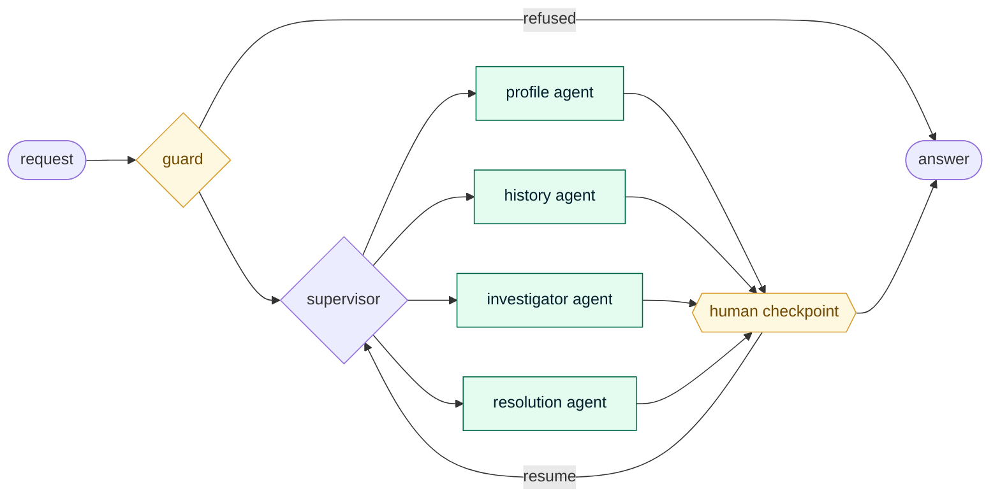
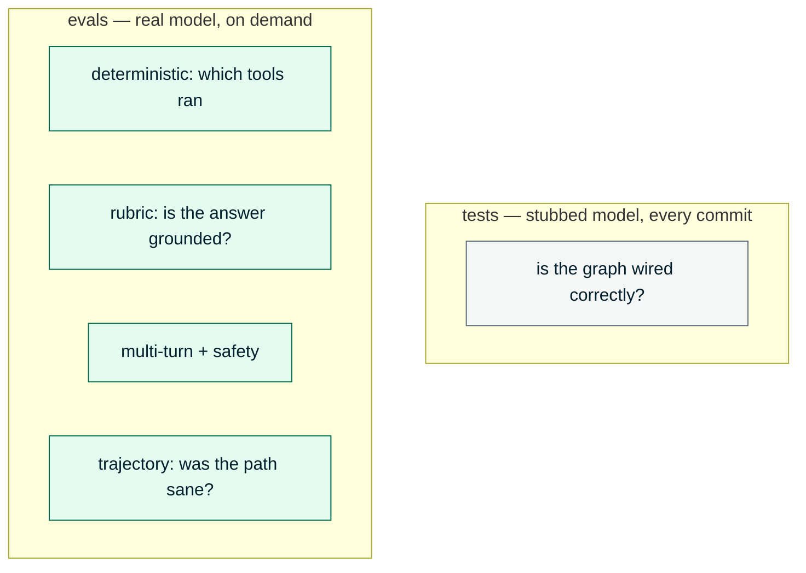
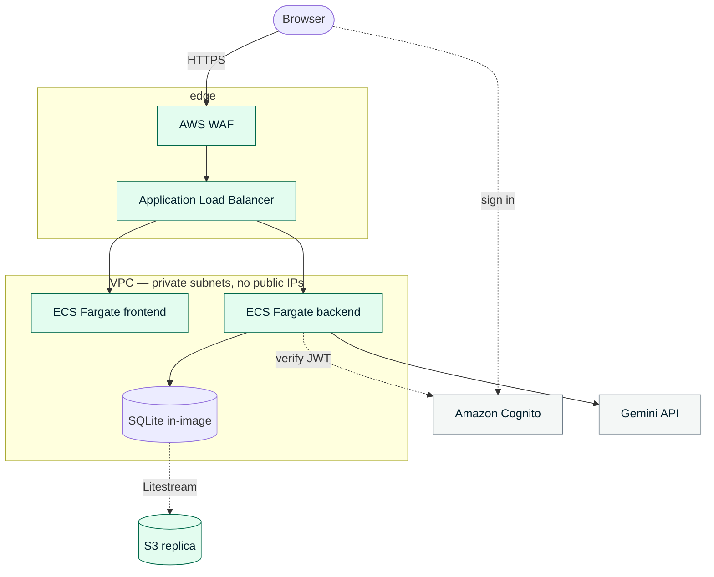
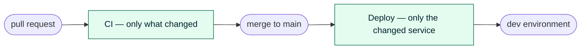

<div align="center">

# CCOA — a production-shaped multi-agent system

**A LangGraph supervisor routing to four specialist agents, evaluated with DeepEval,
shipped on AWS by a pipeline that only rebuilds what changed.**

Use it as a working reference for your own agents — the domain is swappable, the
datastore is behind a seam, and the evaluation layer is the part most examples leave out.

<br/>

[](https://github.com/fadlytanjung/ccoa-agent/actions/workflows/ci.yml)
[](https://github.com/fadlytanjung/ccoa-agent/actions/workflows/deploy.yml)
[](LICENSE)
[](https://paypal.me/fdltanjung)

[](https://www.python.org/)
[](https://langchain-ai.github.io/langgraph/)
[](https://deepeval.com)
[](https://fastapi.tiangolo.com/)
[](https://ai.google.dev/)

[](https://react.dev/)
[](https://www.typescriptlang.org/)
[](https://vite.dev/)
[](https://tailwindcss.com/)

[](https://developer.hashicorp.com/terraform)
[](https://aws.amazon.com/ecs/)
[](https://www.docker.com/)
[](https://aws.amazon.com/cognito/)
[](https://docs.github.com/actions/deployment/security-hardening-your-deployments/about-security-hardening-with-openid-connect)

</div>

---

## Multi-agent, not one prompt with tools

A supervisor reads the request, picks a specialist, and hands over. Each specialist owns
its own tools, its own instructions, and its own idea of when to stop and ask a person.



| Agent | Owns | Stops to ask when |
|---|---|---|
| **profile** | customer lookup, policies | a name matches more than one customer |
| **history** | past interactions, summarising | — |
| **investigator** | claims, cases, knowledge base | evidence is thin enough that a guess would be a guess |
| **resolution** | ticket creation, escalation | **always, before any write** |

Four ask kinds — `clarify`, `confirm`, `approve`, `steer` — share one `interrupt()` node.
Only `approve` is enforced in code; the rest are declared per agent so the interaction
stays a conversation rather than a form. Before a write, the interface shows the **exact
payload**, not a paraphrase, because the graph writes it verbatim and never consults the
model in between.

**Bring your own domain.** The agents are `SKILL.md` files — YAML frontmatter, a Markdown
body, Jinja templates for structured output. Adding an agent is a directory, not a
refactor, and a CI check fails the build on prompt text over 200 characters in Python, so
behaviour cannot quietly migrate back into code.

---

## Evaluated, not just demoed

Most agent examples stop at "it answered". The question that matters afterwards is whether
it is *still* good next week — and that needs a different tool from your test suite.



Built on [DeepEval](https://deepeval.com), with an 11-case dataset in YAML rather than in
assertions, so an expectation about agent behaviour reads as a specification in a diff.

**Evals never run in the merge gate**, deliberately. A failing test is unambiguous; a
failing eval needs a person to decide whether the agent regressed *or the expectation was
wrong*. Put that judgement in the merge path and everyone learns to ignore it.

It paid for itself immediately: the trajectory layer found three real defects the unit
suite could not see — including a tool that was failing on **every single call** from a
missing argument, while the agent worked around it and still produced plausible answers.
Not a crash. A quiet degradation. It also taught scepticism about the judge: of eight eval
failures investigated, most were the *eval* being wrong.

→ [`docs/19-agent-evaluation.md`](docs/19-agent-evaluation.md)

---

## Swap what you need

The interesting choices are behind seams, so this stays a starting point rather than a
fixed application. Each one is a constructor argument or a module, not a fork.

| Want to change | Seam | Status |
|---|---|---|
| **The model** | `build_graph(model=...)` — any LangChain `BaseChatModel` | Gemini today; the tests already inject a stub |
| **Conversation persistence** | `build_graph(checkpointer=...)` — the graph **never** hard-wires one | SQLite saver; the Postgres saver is a first-party package |
| **The database** | `app/repositories/` — the only code that speaks SQL, returning Pydantic models | SQLite; Postgres/Aurora costed in [`docs/15`](docs/15-datastore-options.md) |
| **Vector search** | `RetrievalService`, which already selects a strategy and degrades to keyword | `sqlite-vec`; Qdrant/pgvector would be a third strategy |
| **Embeddings** | `EmbeddingService` | Gemini embeddings |
| **The domain** | `app/agents/skills/<name>/SKILL.md` | Insurance support; nothing below the skill layer knows that |

**Being straight about it:** only the SQLite path is implemented. This project deliberately
runs a single-writer database inside the image and replicates it to S3, because at ~2,000
rows that removes a managed database from a system that does not need one
([ADR-005](docs/adr/ADR-005-runtime-and-persistence.md),
[ADR-007](docs/adr/ADR-007-durable-sqlite-via-s3.md)). The consequence is a real ceiling —
**the backend is capped at one task by a Terraform validation**, because two tasks would be
two divergent databases.

That ceiling is documented rather than hidden, and the way past it is a datastore change,
not a bigger number: [`docs/03 §3.7`](docs/03-architecture.md). The seams above are what
keep that change one layer wide instead of a rewrite.

---

## Run it

```bash
git clone https://github.com/fadlytanjung/ccoa-agent.git
cd ccoa-agent

cp backend/.env.example backend/.env    # add a Gemini API key — free tier is enough
./scripts/preflight.sh                  # checks your tooling, reports everything at once
./scripts/dev.sh                        # API on :8000, app on :5173
```

Open <http://localhost:5173> and ask:

```
Why did John Tan's claim submission fail? Check his policies and open cases.
```

Two customers share that name in the seeded corpus, deliberately — so the agent stops and
asks which one, then investigates and answers with citations you can click. That single
exchange exercises routing, tools, grounding, the human checkpoint, streaming, and the
context panel.

| | |
|---|---|
| Clone → deployment, in order | [`docs/22-getting-started.md`](docs/22-getting-started.md) |
| Everything CI runs | `./scripts/verify.sh` |
| Real Cognito sign-in from localhost | `./scripts/aws-cognito.sh` then `./scripts/dev.sh --cognito` |
| Agent evaluations | `cd backend && uv run deepeval test run evals/test_agent.py` |
| What is built vs. only specified | [`docs/20-implementation-status.md`](docs/20-implementation-status.md) |

---

## Infrastructure



ARM64 Fargate tasks in private subnets with no public IPs. Auth is Cognito with PKCE, and
an unauthenticated request to `/api/*` is refused wherever it comes from — reaching the
edge grants nothing. Full topology and the tradeoffs behind each choice:
[`docs/09-networking.md`](docs/09-networking.md).

---

## Pipeline



Two workflows on purpose. **CI** runs on every branch and pull request, needs no
credentials, and is safe on a fork. **Deploy** runs only on `main`, assumes an AWS role by
OIDC with **no long-lived keys**, and is the only thing that can change the running system.

Both are path-aware. A docs-only change runs the repository checks and finishes in about
ten seconds. Each image is tagged by the last commit that touched *its* service, so a
frontend change leaves the backend's tag untouched and ECS does not replace a task that has
not changed — which matters, because replacing the backend is a brief outage by design.

→ [`docs/11-cicd.md`](docs/11-cicd.md)

---

## Layout

```
backend/     FastAPI + LangGraph. Agents in app/agents/skills, evals in evals/
frontend/    React 19 + Vite + TypeScript, token-based design system
terraform/   VPC, ECS, ALB, Cognito, WAF, S3 — one file per concern
scripts/     preflight · dev · verify · deploy · destroy · AWS bootstrap
docs/        23 specifications and 8 ADRs; start at docs/README.md
tools/       Repository checks that are not tests
```

---

## Documentation

Specifications are the source of truth; code implements them, and the two change together.

- **[`docs/20`](docs/20-implementation-status.md)** — what is actually built. Read first.
- **[`docs/22`](docs/22-getting-started.md)** — clone to deployment.
- **[`docs/05`](docs/05-langgraph-orchestration.md)** — the graph, state, routing, human-in-the-loop.
- **[`docs/17`](docs/17-agent-skills.md)** — how agents are defined, and why not in Python.
- **[`docs/19`](docs/19-agent-evaluation.md)** — the evaluation layers.
- **[`docs/adr/`](docs/adr/)** — eight decisions, including the ones that were reversed.

---

## Contributing

```bash
./scripts/verify.sh     # everything CI runs, in the same order
```

Two rules: **specs and code change together**, and **[`docs/20`](docs/20-implementation-status.md)
is updated by anything that adds, removes, or completes a component** — CI fails if it
drifts.

Issues and pull requests welcome. If this saved you time, a star helps, and
[support](https://paypal.me/fdltanjung) is appreciated but never expected.

---

<div align="center">

All data is **synthetic**, generated deterministically by `backend/app/seed`.
No real customer information exists anywhere in this repository.

[MIT](LICENSE)

</div>
