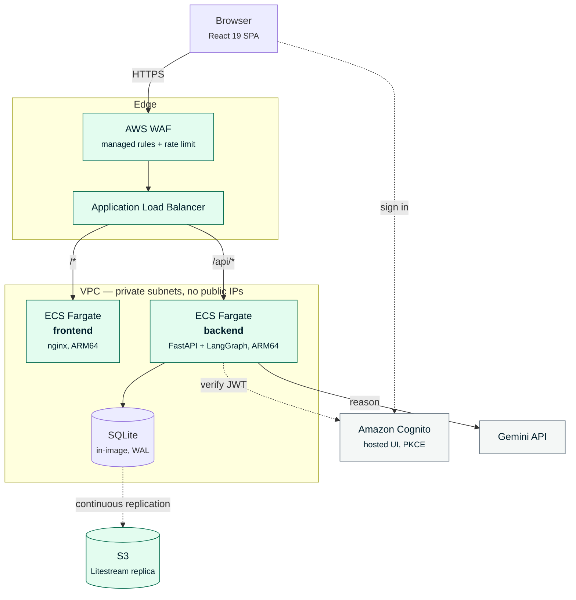
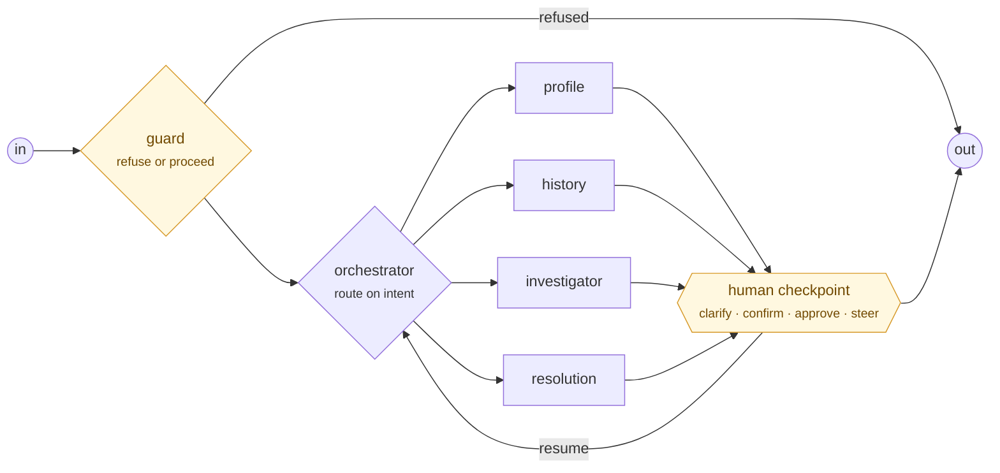
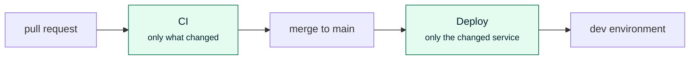

<div align="center">

# CCOA — AI Contact Center Operations Assistant

**A production-shaped LangGraph agent that helps support agents investigate cases,
retrieve customer records, review interactions, and open tickets — with a human in the
loop for every write.**

[](https://github.com/fadlytanjung/ccoa-agent/actions/workflows/ci.yml)
[](https://github.com/fadlytanjung/ccoa-agent/actions/workflows/deploy.yml)
[](LICENSE)

Python 3.12 · FastAPI · LangGraph 1.2 · React 19 · Terraform · AWS ECS Fargate

</div>

---

## What this is

An operations assistant for an insurance contact centre. An agent asks a question in plain
language; the system routes it through a LangGraph supervisor to one of four specialists,
which read real records, cite what they used, and stop to ask a human before anything is
written.

It is built to be **inspected**, not just demonstrated. Every claim the interface makes
about the system — that a checkpoint survives a restart, that a database survives a
deploy, that an unauthenticated request is refused — has a test that fails if it stops
being true.

```
Why did John Tan's claim submission fail? Check his policies and open cases.
```

Two customers share that name in the seeded corpus, deliberately. The agent stops and asks
which one, then investigates and answers with citations you can click.

<div align="center">
  <em>Ask → route → investigate → cite → confirm before writing.</em>
</div>

---

## Quick start

```bash
git clone https://github.com/fadlytanjung/ccoa-agent.git
cd ccoa-agent

cp backend/.env.example backend/.env    # add a Gemini API key (free tier is enough)
./scripts/preflight.sh                  # checks your tooling, reports everything at once
./scripts/dev.sh                        # API on :8000, app on :5173
```

Open <http://localhost:5173>. First run takes a couple of minutes; after that, seconds.

| | |
|---|---|
| Full guide, clone → deployment | [`docs/22-getting-started.md`](docs/22-getting-started.md) |
| Run every check CI runs | `./scripts/verify.sh` |
| Real Cognito sign-in, from localhost | `./scripts/aws-cognito.sh` then `./scripts/dev.sh --cognito` |
| What is built vs. only specified | [`docs/20-implementation-status.md`](docs/20-implementation-status.md) |

---

## Architecture



The full topology, security boundaries, and the tradeoffs behind each choice are in
[`docs/09-networking.md`](docs/09-networking.md) and
[`docs/03-architecture.md`](docs/03-architecture.md).

### The agent graph



Four ask kinds share one `interrupt()` node. Only `approve` is enforced in code — the rest
are declared per skill, so the interaction stays conversational rather than becoming a
form. See [`docs/05-langgraph-orchestration.md`](docs/05-langgraph-orchestration.md).

---

## What might be worth borrowing

| Idea | Where |
|---|---|
| **Agent behaviour lives in Markdown, not Python.** Skills are `SKILL.md` files with YAML frontmatter and Jinja templates; a CI check fails the build on prompt text over 200 characters in code | [`docs/17`](docs/17-agent-skills.md) |
| **Evals are not tests.** Five layers, real model, a YAML dataset — run on demand, never in the merge gate, because a failure needs a human to decide whether the agent or the expectation was wrong | [`docs/19`](docs/19-agent-evaluation.md) |
| **Durable SQLite.** The database ships inside the image and replicates to S3 continuously, so a ticket survives a deploy without operating a database | [`ADR-007`](docs/adr/ADR-007-durable-sqlite-via-s3.md) |
| **An implementation-status document that cannot rot.** A CI check verifies its claims against the tree — counts, paths, and whether a directory it calls empty still is | [`docs/20`](docs/20-implementation-status.md) |
| **Container checks for silent failures.** A container that never restores its database still boots and passes health checks. Two scripts prove the things that fail quietly | [`docs/07 §3.9`](docs/07-frontend.md) |

---

## Layout

```
backend/     FastAPI + LangGraph. Skills in app/agents/skills, evals in evals/
frontend/    React 19 + Vite + TypeScript, token-based design system
terraform/   VPC, ECS, ALB, Cognito, WAF, S3 — one file per concern
scripts/     preflight · dev · verify · deploy · destroy · AWS bootstrap
docs/        23 specifications and 8 ADRs, numbered; start at docs/README.md
tools/       Repository checks that are not tests
```

---

## Pipeline



Two workflows on purpose. **CI** runs on every branch and pull request, needs no
credentials, and is safe on a fork. **Deploy** runs only on `main`, assumes an AWS role by
OIDC with no long-lived keys, and is the only thing that can change the running system.

Both are path-aware: a frontend change builds and deploys the frontend, and leaves the
backend's image tag exactly as it was so ECS does not replace a task that has not changed.
Details in [`docs/11-cicd.md`](docs/11-cicd.md).

---

## Documentation

Specifications are the source of truth; code implements them, and the two change together.
Start with [`docs/README.md`](docs/README.md) for the reading order, or:

- **[`docs/20`](docs/20-implementation-status.md)** — what is actually built. Read this first.
- **[`docs/22`](docs/22-getting-started.md)** — clone to deployment, in order.
- **[`docs/00`](docs/00-constitution.md)** — the binding principles behind every other document.
- **[`docs/adr/`](docs/adr/)** — eight decisions, including the ones that were reversed.

---

## Contributing

Issues and pull requests are welcome. Before opening one:

```bash
./scripts/verify.sh     # everything CI runs, in the same order
```

Two rules worth knowing:

1. **Specs and code change together.** If code must diverge from `docs/`, update the
   document in the same commit.
2. **`docs/20` is the checkpoint.** Anything that adds, removes, or completes a component
   updates it in the same change. CI fails if it drifts.

---

## Support

If this saved you time, or you learned something from the way it is put together:

<div align="center">

[](https://paypal.me/fdltanjung)

**[paypal.me/fdltanjung](https://paypal.me/fdltanjung)**

</div>

Starring the repository helps too, and costs nothing.

---

## Notes

All data is **synthetic** — generated deterministically by `backend/app/seed`. No real
customer information exists anywhere in this repository or in anything it deploys.

Licensed under the [MIT License](LICENSE).
