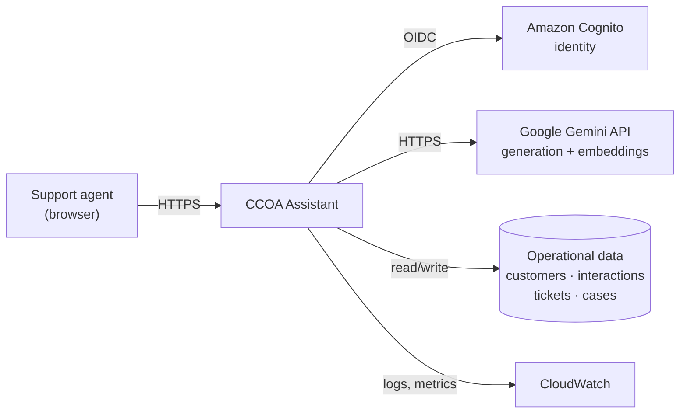
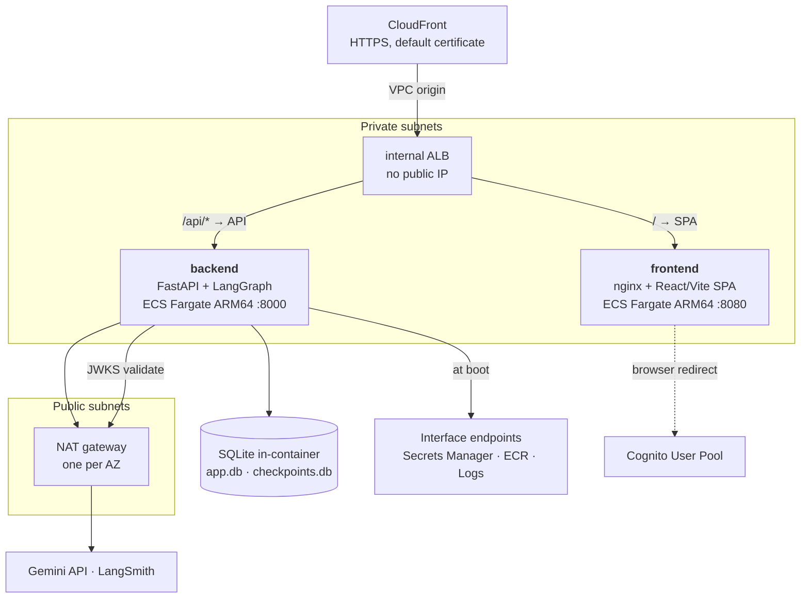
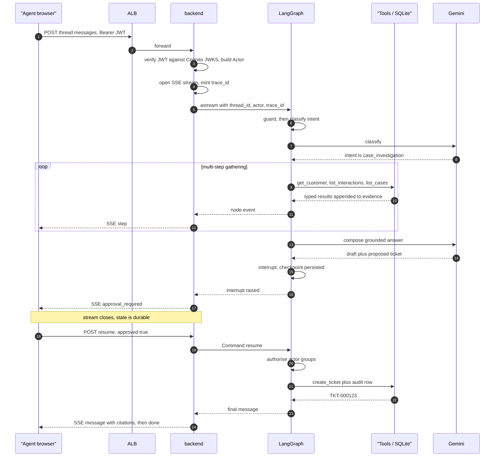
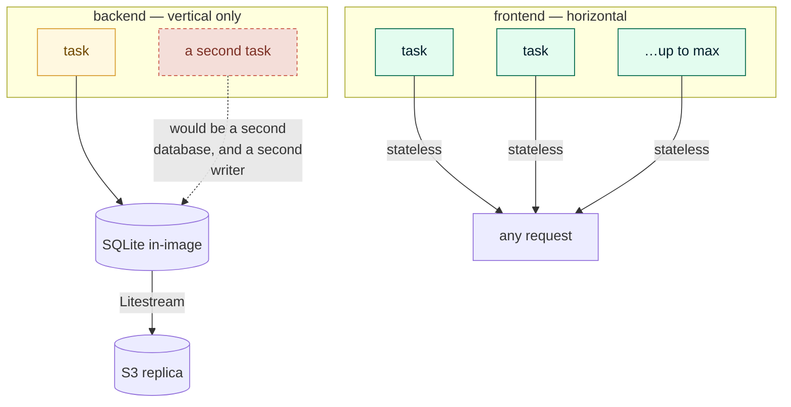

# 03 — Architecture

> **Status:** Approved — 2026-08-22
> **Satisfies:** REQ-001–006, REQ-040, REQ-045, REQ-092
> **Depends on:** [00 — Constitution](00-constitution.md), [02 — Research](02-research.md), [ADR-005](adr/ADR-005-runtime-and-persistence.md), [ADR-006](adr/ADR-006-requirement-alignment-over-cost.md)

## 1. Purpose

Defines the system's decomposition into deployable services, the boundaries between
them, and the lifecycle of a single agent request from browser to model and back.
It does not specify the graph's internals ([05](05-langgraph-orchestration.md)), the
HTTP contract ([06](06-backend-api.md)), or the AWS resources ([08](08-infrastructure.md)).

## 2. Scope

**In scope:** service decomposition, responsibility boundaries, request lifecycle,
runtime topology, cross-cutting concerns (config, logging, tracing, errors).

**Out of scope:** VPC/subnet design, IAM policy text, graph node implementations,
UI component structure, database schema.

---

## 3. Design

### 3.1 Context



The assistant is an **internal tool**. Its user is a support agent, never an end
customer. That single fact drives most of the security posture: authenticated access
only, group-based authorisation, and a full audit trail of who asked the system to do
what ([10](10-security.md)).

### 3.2 Services

Two independently deployable services, as REQ-006 requires — separate repositories
directories, Dockerfiles, ECR repositories, ECS services, task definitions, and
pipeline jobs. Neither can block the other's release.



| Service | Responsibility | Explicitly not responsible for |
|---|---|---|
| `frontend` | Render the conversational UI, run the OIDC/PKCE login flow, hold tokens in memory, stream and display agent output, present approval prompts | Business logic, LLM calls, data access, authorisation decisions |
| `backend` | LangGraph orchestration, tool execution, data access, LLM integration, authentication verification, authorisation enforcement, audit logging | Rendering, session cookies, any UI concern |

**The frontend is not a trust boundary.** It holds a token and draws pixels. Every
authorisation decision is made in the backend, on the token's claims, and would hold
even if the SPA were replaced by `curl`.

### 3.3 Backend internal structure

Layered, with dependencies pointing inward. The graph never touches SQL; repositories
never know about LangGraph.

```
app/
├── main.py             FastAPI app factory, lifespan, middleware
├── config.py           Typed settings, validated once at boot
├── api/                HTTP layer — routers, request/response schemas, SSE
│   ├── deps.py           auth dependency: JWT verify → Actor
│   └── v1/               threads, messages, resume, customers, health
├── graph/              LangGraph orchestration  ─────────► docs/05
│   ├── builder.py        build_graph(checkpointer=None)   ◄── the only entry point
│   ├── state.py          AgentState + reducers
│   ├── nodes/            guard, orchestrator, specialists, human, commit, respond
│   └── tools/            typed tool functions the model may call
├── agents/             Agent behaviour, not code  ───────► docs/17
│   ├── registry.py       loads + validates skills at boot
│   └── skills/           orchestrator/ profile/ history/ investigator/ resolution/
│                           each: SKILL.md + references/ + templates/
├── domain/             Pure business types + rules (no I/O)
├── repositories/       SQLite data access, one per aggregate
├── services/           LLM binding, embeddings, audit, retrieval
└── seed/               Deterministic data generation  ────► docs/12
```

Two rules make this hold:

- **Tools are the only bridge between the graph and the data.** A node never opens a
  database connection; it calls a tool, which calls a repository.
- **`build_graph(checkpointer=None)` is the sole construction path.** Persistence is
  injected by the caller — FastAPI, LangGraph Studio, or a test ([14](14-local-dev.md)).

### 3.4 Request lifecycle

The path of one agent turn, including the human-in-the-loop pause:



Points worth naming:

- **The interrupt is durable, not a held connection.** The checkpoint is written before
  the stream closes, so the browser can be refreshed, the task can be replaced, and the
  pending approval survives (REQ-091).
- **Authorisation is re-checked on resume**, not only when the draft was proposed. The
  approving actor is the one that matters.
- **The audit row is written in the same step as the mutation**, so an approved-but-
  unlogged write is not representable ([10](10-security.md) §7).

### 3.5 Runtime topology

| Concern | Choice | Why |
|---|---|---|
| Compute | ECS Fargate, **ARM64** | No servers to patch; ARM is ~20% cheaper than x86 in Singapore ([02](02-research.md) §6) |
| Backend scaling | **`min 0 / max 1`** | Scale-to-zero is safe because Litestream replicates to S3. `max 1` is a correctness bound — two tasks would be two divergent datasets, and Litestream corrupts with >1 writer — [04](04-data-model.md) §3.5 |
| Frontend scaling | `min 0 / max 2` | Stateless; scales to zero, ~30–45 s cold start |
| Deployment | Rolling, `minimumHealthyPercent = 0` | With one task, rolling means brief downtime. Acceptable for an internal demo tool; the alternative costs a second task |
| State | Two SQLite files **inside the container**, replicated to S3 by Litestream | `app.db` and `checkpoints.db` kept separate so checkpoint churn cannot block business reads. Restored on boot, so data survives deploys and crashes — [ADR-007](adr/ADR-007-durable-sqlite-via-s3.md) |
| Secrets | Secrets Manager → task env at start | Never in the image or task-definition plaintext ([10](10-security.md) §4) |

### 3.6 Cross-cutting concerns

**Configuration.** One Pydantic `Settings` model, validated at import. A missing
required variable raises at boot, not on the first request. No code branches on
"am I in AWS" — only on values.

**Tracing.** A `trace_id` is minted at the HTTP edge (or adopted from
`X-Request-Id`), placed in a `contextvar`, attached to the LangGraph config, and
emitted on every log line and audit row. One identifier links an HTTP request, its
graph run, its tool calls, and its audit trail.

**Logging.** Structured JSON to stdout → CloudWatch Logs. Logged: `trace_id`,
`thread_id`, actor `sub`, node name, tool name, decision, duration, outcome, token
usage. **Never logged:** message content, customer PII, the API key.

**Errors.** Three layers, each with a different audience:

| Layer | Mechanism | Surfaces as |
|---|---|---|
| Tool | Returns a typed `ToolError`, never raises | A routable value in `state.error` |
| Graph | `error_handler` node — retry, degrade, or surface | An honest assistant message |
| HTTP | Exception middleware → RFC 9457 problem detail | `{type, title, status, detail, trace_id}` |

The tool layer is the important one: a raising tool would abort the run and lose the
partial evidence already gathered. Detail in [05](05-langgraph-orchestration.md) §Failure modes.

---

### 3.7 Scaling, and where it stops

*(Added 2026-08-23.)* The two services scale differently, and the difference is not
tuning — it is a property of the datastore.



| Service | Scales | Ceiling | Why |
|---|---|---|---|
| `frontend` | Horizontally | `var.frontend_max_capacity` (2) | Stateless: serves static files and calls nothing. Ordinary tuning |
| `backend` | **Vertically only** | **`1`, enforced by a variable validation** | Each task carries its own SQLite file. Two tasks are two divergent datasets — a ticket created on one is invisible to the other ([04](04-data-model.md) §3.5) — and two Litestream writers corrupt the replica ([ADR-007](adr/ADR-007-durable-sqlite-via-s3.md)) |

The backend ceiling is expressed in code rather than left to convention, so raising it is a
deliberate act that fails loudly:

```hcl
validation {
  condition     = var.backend_max_capacity == 1
  error_message = "The backend must stay at exactly 1 task. See ADR-007 and docs/04 §3.5."
}
```

**More traffic therefore means a bigger task, not more tasks.** At this corpus size — ~2,000
rows, a handful of concurrent agents — that is genuinely sufficient, and the honest reason
for the design is that it removes a managed database from a system that does not need one
([ADR-005](adr/ADR-005-runtime-and-persistence.md)).

**What would have to change to scale out.** Not the variable — the datastore. The options
are costed in [15](15-datastore-options.md); the shape of the work is:

| Step | Consequence |
|---|---|
| Move the corpus to a networked store (Aurora Serverless, Neon, RDS) | Removes the single-writer constraint and Litestream with it |
| Replace `langgraph-checkpoint-sqlite` | The Postgres checkpointer is a first-party package, so this is a swap, not a rewrite — `build_graph(checkpointer=None)` already exists for exactly this reason ([00](00-constitution.md) §3) |
| Move vectors out of `sqlite-vec` | A semantic hit currently joins to its interaction in one query ([13](13-vector-search.md) §3.1); across two stores it becomes two |
| Raise `backend_max_capacity` | The last step, not the first |

The constitution's rule that the graph never hard-wires a checkpointer is what keeps that
path open: the Agent Server, FastAPI, and the tests each supply their own today, and a
Postgres saver would be a fourth.

**What does not need to change.** The frontend, the API contract, the skills, the
authorisation model, and every test above the repository layer. The seam is deliberately
one layer wide.

## 4. Decisions and tradeoffs

| Decision | Alternatives considered | Rationale |
|---|---|---|
| Two services, path-routed behind one ALB | Two ALBs; API Gateway + ALB; CloudFront + S3 for the SPA | One ALB at $0.0252/hr serves both and still satisfies independent deployment. Two ALBs double the largest fixed cost for no gain at this scale |
| SPA on ECS, not S3 + CloudFront | S3 + CloudFront (~$1/mo, cheaper) | The requirements mandate ECS. Serving the SPA from a container makes the ECS requirement true of *both* services rather than one. [ADR-003](adr/ADR-003-frontend-runtime.md) |
| Gemini API, not Bedrock | Bedrock (VPC-private, IAM auth) | Bedrock model access is `NOT_AUTHORIZED` on this account and current models are global-routed only ([02](02-research.md) §2). Cost: a NAT gateway is now required. [ADR-001](adr/ADR-001-llm-provider.md) |
| Backend validates JWTs itself | ALB `authenticate-cognito` action | ALB OIDC is built for server-rendered apps; its redirect flow is awkward for SPA XHR and SSE. Validating in the app also keeps authorisation testable without AWS |
| SSE, not WebSockets | WebSocket; long-poll | Streaming is one-directional. SSE traverses ALB cleanly, needs no protocol upgrade, and reconnects natively |
| Single backend task | Multi-task with a shared datastore | In-container SQLite makes >1 task incorrect, not merely contended. Alternatives are costed in [15](15-datastore-options.md) but deliberately not implemented — [ADR-006](adr/ADR-006-requirement-alignment-over-cost.md) §1a |
| ARM64 tasks | x86_64 | ~20% cheaper, verified. No dependency in the stack lacks an arm64 wheel |

## 5. Failure modes

| Failure | Detection | Behaviour |
|---|---|---|
| Gemini unreachable or 5xx | Timeout / status in the LLM adapter | Bounded retry with jittered backoff; then a plain "the model is unavailable" message. Evidence already gathered is still shown |
| Gemini rate-limited (429) | Status code | Honour `Retry-After`; surface a wait message rather than silently stalling |
| Database file missing or corrupt | `/readyz` integrity probe fails | Task fails readiness → ALB stops routing → ECS replaces it with a fresh seeded image |
| SQLite lock contention | `SQLITE_BUSY` after `busy_timeout` | Repository raises → tool returns `ToolError(retryable=True)` → graph retries once, then surfaces. Rare under WAL |
| Checkpoint DB corrupt | Checkpointer error at run start | Run fails closed with a clear error; existing threads are unreadable rather than silently wrong |
| Cognito JWKS unreachable | Fetch failure | Cached keys serve until TTL; on expiry, requests fail closed with 401 |
| Model proposes an unauthorised action | Authorisation check in the tool | `ToolError(code="forbidden")`; the graph explains the missing permission. Never a silent no-op |
| Task replaced mid-approval | — | Approval is a durable checkpoint, not a connection. Resume works against the new task |

## 6. Open questions

1. **Custom domain and TLS.** The demo can run on the ALB's default DNS name, which
   means no ACM certificate and an HTTP listener. That weakens the security story
   materially. Resolving this needs a Route 53 hosted zone or an owned domain —
   pending in [08](08-infrastructure.md).
2. **Frontend task count.** Held at 1 for cost, which makes frontend deploys briefly
   interrupt-y. Worth $0.02/hr to run 2? Leaning no for a demo.
3. **SSE through ALB idle timeout.** Default is 60s; a long investigation could exceed
   it. Plan is heartbeat comments every 15s plus raising the idle timeout to 120s —
   to be confirmed once real latencies are measured.
