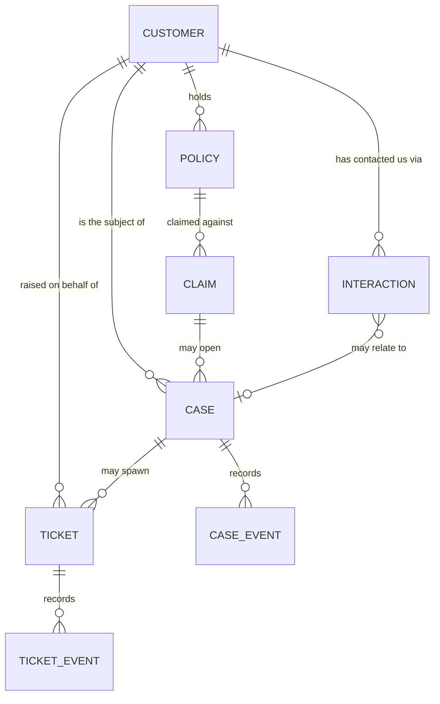

# 04 — Data model

> **Status:** Approved — 2026-08-22
> **Satisfies:** REQ-004, REQ-030–034, REQ-065
> **Depends on:** [03 — Architecture](03-architecture.md)

## 1. Purpose

Defines the entities the assistant reasons over, their SQLite schema, and the access
rules that keep the agent's answers grounded. The volume and realism of the *data* is
specified separately in [12 — Seed data](12-seed-data.md); this document specifies its
*shape*.

## 2. Scope

**In scope:** entity definitions, relationships, DDL, identifiers, indexes, SQLite
pragmas, migrations, repository contract, retention.

**Out of scope:** which datastore and why ([15](15-datastore-options.md)), vector
tables ([13](13-vector-search.md)), seed generation ([12](12-seed-data.md)).

---

## 3. Design

### 3.1 Domain

An insurance contact centre. The reference scenario is a *failed claim submission*,
so claims are first-class rather than implied.



Two shapes matter for the agent's behaviour:

- **`INTERACTION → CASE` is optional.** Most contacts are routine and belong to no
  case. Investigation is largely the work of deciding whether scattered interactions
  add up to one.
- **`CASE` and `TICKET` are distinct.** A *case* is the customer's problem — possibly
  long-running, possibly spanning claims. A *ticket* is a unit of work assigned to
  someone. One case can produce several tickets. Conflating them would make REQ-022
  (investigate) and REQ-023 (create ticket) the same operation, which they are not.

### 3.2 Identifiers

Human-readable, prefixed, zero-padded. Agents read these aloud on calls, and the
model quotes them in answers — opaque UUIDs would make both worse and would make
grounding harder to verify.

| Entity | Format | Example |
|---|---|---|
| Customer | `CUST-` + 6 digits | `CUST-004217` |
| Policy | `POL-` + 8 digits | `POL-00931744` |
| Claim | `CLM-` + 8 digits | `CLM-00184402` |
| Interaction | `INT-` + 8 digits | `INT-00027311` |
| Case | `CASE-` + 6 digits | `CASE-000412` |
| Ticket | `TKT-` + 6 digits | `TKT-000123` |
| KB article | `KB-` + 4 digits | `KB-0031` |

All are validated at the API and tool boundary against these exact patterns
(`^CUST-[0-9]{6}$` and so on). A malformed identifier is a `422`, never a lookup.

### 3.3 Conventions

- Timestamps are **ISO-8601 UTC strings** (`2026-08-21T04:11:32Z`). SQLite has no date
  type; text sorts correctly in this format and stays readable in the file.
- Enumerations are `TEXT` with a `CHECK` constraint — self-documenting in the schema,
  and mirrored by a Python `StrEnum`.
- Money is **integer minor units** (cents). No floats anywhere near a currency value.
- `PRAGMA foreign_keys = ON` per connection (SQLite defaults it off).
- Every table carries `created_at`; mutable tables also carry `updated_at`.

### 3.4 Schema — `app.db`

```sql
PRAGMA foreign_keys = ON;
PRAGMA journal_mode = WAL;        -- local container filesystem — ADR-005 §3
PRAGMA busy_timeout = 5000;
PRAGMA synchronous  = FULL;

CREATE TABLE customer (
    customer_id     TEXT PRIMARY KEY,
    full_name       TEXT    NOT NULL,
    email           TEXT    NOT NULL UNIQUE,
    phone           TEXT    NOT NULL,
    date_of_birth   TEXT    NOT NULL,
    address_line1   TEXT    NOT NULL,
    city            TEXT    NOT NULL,
    postal_code     TEXT    NOT NULL,
    country         TEXT    NOT NULL DEFAULT 'SG',
    tier            TEXT    NOT NULL CHECK (tier IN ('standard','silver','gold','platinum')),
    status          TEXT    NOT NULL CHECK (status IN ('active','suspended','closed')),
    preferred_lang  TEXT    NOT NULL DEFAULT 'en',
    risk_flag       INTEGER NOT NULL DEFAULT 0 CHECK (risk_flag IN (0,1)),
    created_at      TEXT    NOT NULL,
    updated_at      TEXT    NOT NULL
);
CREATE INDEX idx_customer_name  ON customer(full_name);
CREATE INDEX idx_customer_email ON customer(email);

CREATE TABLE policy (
    policy_id       TEXT PRIMARY KEY,
    customer_id     TEXT    NOT NULL REFERENCES customer(customer_id) ON DELETE CASCADE,
    product         TEXT    NOT NULL CHECK (product IN ('motor','health','travel','home','life')),
    status          TEXT    NOT NULL CHECK (status IN ('active','lapsed','cancelled','pending')),
    premium_cents   INTEGER NOT NULL CHECK (premium_cents >= 0),
    currency        TEXT    NOT NULL DEFAULT 'SGD',
    effective_from  TEXT    NOT NULL,
    effective_to    TEXT,
    created_at      TEXT    NOT NULL
);
CREATE INDEX idx_policy_customer ON policy(customer_id);

CREATE TABLE claim (
    claim_id        TEXT PRIMARY KEY,
    policy_id       TEXT    NOT NULL REFERENCES policy(policy_id) ON DELETE CASCADE,
    customer_id     TEXT    NOT NULL REFERENCES customer(customer_id) ON DELETE CASCADE,
    status          TEXT    NOT NULL CHECK (status IN
                        ('draft','submitted','submission_failed','under_review',
                         'approved','rejected','paid','withdrawn')),
    -- populated only when status = 'submission_failed'; the investigation scenario
    -- (REQ-022) keys off this column
    failure_code    TEXT    CHECK (failure_code IN
                        ('DOC_MISSING','DOC_UNREADABLE','POLICY_LAPSED','DUPLICATE',
                         'VALIDATION_ERROR','GATEWAY_TIMEOUT','LIMIT_EXCEEDED')),
    failure_detail  TEXT,
    amount_cents    INTEGER NOT NULL CHECK (amount_cents >= 0),
    currency        TEXT    NOT NULL DEFAULT 'SGD',
    incident_date   TEXT    NOT NULL,
    submitted_at    TEXT,
    channel         TEXT    NOT NULL CHECK (channel IN ('web','mobile','agent','broker')),
    created_at      TEXT    NOT NULL,
    updated_at      TEXT    NOT NULL
);
CREATE INDEX idx_claim_customer ON claim(customer_id, created_at);
CREATE INDEX idx_claim_status   ON claim(status);

CREATE TABLE interaction (
    interaction_id  TEXT PRIMARY KEY,
    customer_id     TEXT    NOT NULL REFERENCES customer(customer_id) ON DELETE CASCADE,
    case_id         TEXT    REFERENCES "case"(case_id) ON DELETE SET NULL,
    channel         TEXT    NOT NULL CHECK (channel IN ('voice','chat','email','callback')),
    direction       TEXT    NOT NULL CHECK (direction IN ('inbound','outbound')),
    subject         TEXT    NOT NULL,
    transcript      TEXT    NOT NULL,
    summary         TEXT    NOT NULL,
    sentiment       TEXT    NOT NULL CHECK (sentiment IN ('positive','neutral','negative')),
    handled_by      TEXT    NOT NULL,
    duration_sec    INTEGER NOT NULL CHECK (duration_sec >= 0),
    occurred_at     TEXT    NOT NULL,
    created_at      TEXT    NOT NULL
);
CREATE INDEX idx_interaction_customer ON interaction(customer_id, occurred_at);
CREATE INDEX idx_interaction_case     ON interaction(case_id);

CREATE TABLE "case" (
    case_id         TEXT PRIMARY KEY,
    customer_id     TEXT    NOT NULL REFERENCES customer(customer_id) ON DELETE CASCADE,
    claim_id        TEXT    REFERENCES claim(claim_id) ON DELETE SET NULL,
    title           TEXT    NOT NULL,
    category        TEXT    NOT NULL CHECK (category IN
                        ('claim_issue','billing','coverage_query','complaint',
                         'policy_change','technical')),
    status          TEXT    NOT NULL CHECK (status IN
                        ('open','investigating','pending_customer','escalated','resolved','closed')),
    priority        TEXT    NOT NULL CHECK (priority IN ('low','medium','high','critical')),
    summary         TEXT    NOT NULL,
    owner           TEXT,
    escalated_to    TEXT,
    opened_at       TEXT    NOT NULL,
    resolved_at     TEXT,
    created_at      TEXT    NOT NULL,
    updated_at      TEXT    NOT NULL
);
CREATE INDEX idx_case_customer ON "case"(customer_id, opened_at);
CREATE INDEX idx_case_status   ON "case"(status, priority);

CREATE TABLE ticket (
    ticket_id       TEXT PRIMARY KEY,
    customer_id     TEXT    NOT NULL REFERENCES customer(customer_id) ON DELETE CASCADE,
    case_id         TEXT    REFERENCES "case"(case_id) ON DELETE SET NULL,
    title           TEXT    NOT NULL,
    description     TEXT    NOT NULL,
    category        TEXT    NOT NULL CHECK (category IN
                        ('claim_issue','billing','coverage_query','complaint',
                         'policy_change','technical')),
    priority        TEXT    NOT NULL CHECK (priority IN ('low','medium','high','critical')),
    status          TEXT    NOT NULL CHECK (status IN
                        ('open','in_progress','pending','resolved','closed')),
    assignee        TEXT,
    -- provenance: who/what created this row. 'assistant' rows are always
    -- human-approved (docs/05 §HITL) and always have an audit_log entry.
    created_by      TEXT    NOT NULL,
    created_via     TEXT    NOT NULL CHECK (created_via IN ('assistant','agent_manual','system')),
    created_at      TEXT    NOT NULL,
    updated_at      TEXT    NOT NULL
);
CREATE INDEX idx_ticket_customer ON ticket(customer_id, created_at);
CREATE INDEX idx_ticket_case     ON ticket(case_id);

CREATE TABLE case_event (
    event_id        INTEGER PRIMARY KEY AUTOINCREMENT,
    case_id         TEXT NOT NULL REFERENCES "case"(case_id) ON DELETE CASCADE,
    event_type      TEXT NOT NULL,
    detail          TEXT NOT NULL,
    actor           TEXT NOT NULL,
    occurred_at     TEXT NOT NULL
);
CREATE INDEX idx_case_event_case ON case_event(case_id, occurred_at);

CREATE TABLE ticket_event (
    event_id        INTEGER PRIMARY KEY AUTOINCREMENT,
    ticket_id       TEXT NOT NULL REFERENCES ticket(ticket_id) ON DELETE CASCADE,
    event_type      TEXT NOT NULL,
    detail          TEXT NOT NULL,
    actor           TEXT NOT NULL,
    occurred_at     TEXT NOT NULL
);
CREATE INDEX idx_ticket_event_ticket ON ticket_event(ticket_id, occurred_at);

CREATE TABLE kb_article (
    article_id      TEXT PRIMARY KEY,
    title           TEXT NOT NULL,
    category        TEXT NOT NULL,
    body            TEXT NOT NULL,
    applies_to      TEXT,          -- comma-separated failure_code values, nullable
    updated_at      TEXT NOT NULL
);

-- Append-only. Every mutating tool call writes exactly one row. docs/10 §7.
CREATE TABLE audit_log (
    audit_id        INTEGER PRIMARY KEY AUTOINCREMENT,
    trace_id        TEXT NOT NULL,
    thread_id       TEXT,
    actor_sub       TEXT NOT NULL,
    actor_email     TEXT NOT NULL,
    actor_groups    TEXT NOT NULL,
    action          TEXT NOT NULL,
    target_type     TEXT NOT NULL,
    target_id       TEXT,
    outcome         TEXT NOT NULL CHECK (outcome IN ('allowed','denied','failed')),
    detail          TEXT,
    occurred_at     TEXT NOT NULL
);
CREATE INDEX idx_audit_trace  ON audit_log(trace_id);
CREATE INDEX idx_audit_actor  ON audit_log(actor_sub, occurred_at);
CREATE INDEX idx_audit_target ON audit_log(target_type, target_id);
```

**Indexes are ascending**, including the ones supporting `ORDER BY … DESC` queries.
SQLite scans an index in either direction at the same cost, so a descending index buys
nothing — and an expression index is compared unreliably by Alembic's autogenerate,
which would make `alembic check` report a permanent phantom diff. *(Amended 2026-08-22:
these five indexes were originally specified `DESC`.)*

`case` is a SQL reserved word, hence the quoting. It is kept because renaming it to
`support_case` would put a layer of translation between the domain language the requirements
uses and the schema — a worse trade than quoting one identifier.

### 3.4a Conversation threads

*(Added 2026-08-22 — this table was missing from the original schema.)*

```sql
CREATE TABLE thread (
    thread_id            TEXT PRIMARY KEY,
    owner_sub            TEXT    NOT NULL,
    title                TEXT    NOT NULL,
    subject_customer_id  TEXT,
    message_count        INTEGER NOT NULL DEFAULT 0,
    created_at           TEXT    NOT NULL,
    updated_at           TEXT    NOT NULL
);
CREATE INDEX idx_thread_owner ON thread(owner_sub, updated_at);
```

The conversation *content* lives in the checkpointer's own database, whose schema this
service does not own and must not query ([§3.5](#35-two-databases-in-the-container)).
But two things the API contract requires cannot be answered from there:

- **Ownership.** `GET /api/v1/threads/{id}` returns `404` for a thread the caller does
  not own ([06](06-backend-api.md) §3.3). That check needs a creator recorded somewhere
  the application controls.
- **Listing.** `GET /api/v1/threads` renders a list without loading any checkpoints.

Deliberately **no foreign key to `customer`**: `subject_customer_id` is a hint for the
list view, and a thread must survive the customer record being reseeded.

### 3.5 Two databases, in the container

| File | Contents | Written by | Churn |
|---|---|---|---|
| `/data/app.db` | Business data above | Repositories | Low — reads dominate |
| `/data/checkpoints.db` | LangGraph checkpoints and writes | `AsyncSqliteSaver` | **High** — several writes per node |

Both are local container files, not network storage ([ADR-005](adr/ADR-005-runtime-and-persistence.md) §3).
They stay separate so checkpoint write traffic cannot hold a lock that blocks a customer
lookup.

**One task, always.** Each task carries its own copy of the database, so two tasks would
be two divergent datasets — a ticket created on one invisible to the other. ECS
`max_capacity` is **1** as a correctness constraint, not tuning. Litestream makes that
bound load-bearing a second time: **it corrupts data with more than one writer.**

**Durability.** Both files are replicated to S3 by Litestream and restored on boot, so
they survive deploys, crashes, and task replacement — losing at most ~1 s of writes on
an abrupt kill ([ADR-007](adr/ADR-007-durable-sqlite-via-s3.md)). WAL mode is what makes
this possible, and is available because the database is on a local filesystem.

The checkpoint schema is owned by `langgraph-checkpoint-sqlite` and must not be
hand-modified. It is created by `saver.setup()` at boot.

### 3.6 Repository contract

Repositories are the only code that speaks SQL. Each returns Pydantic models, never
raw rows or `sqlite3.Row`.

```python
class CustomerRepository(Protocol):
    def get(self, customer_id: CustomerId) -> Customer | None: ...
    def search_by_name(self, name: str, limit: int = 10) -> list[CustomerMatch]: ...
    def get_by_email(self, email: str) -> Customer | None: ...
```

Three rules:

1. **Search returns candidates, never a guess.** `search_by_name("John Tan")` returning
   two people returns both. Disambiguation is the agent's job, in conversation with
   the human — silently picking the first match is how the assistant ends up discussing
   the wrong person's medical claim.
2. **Reads are unbounded only by explicit `limit`.** Defaults are small (10–20) so a
   chatty customer cannot flood the model's context.
3. **Writes go through a single `transaction()` context manager** that also writes the
   `audit_log` row. Committing a mutation without its audit entry is not expressible.

### 3.7 Migrations — Alembic

Schema changes are Alembic revisions ([ADR-006](adr/ADR-006-requirement-alignment-over-cost.md) §1).

```
backend/alembic/
├── env.py                      reads DATABASE_URL; render_as_batch=True for SQLite
├── script.py.mako
└── versions/
    ├── 0001_initial.py
    └── 0002_vector_tables.py   # docs/13 — applied only when vector search is enabled
```

The deciding argument is portability, not ceremony: the `DATABASE_URL` escape hatch
means this schema must run on **both SQLite and Postgres**. Hand-maintaining two
dialects of forward-only SQL is precisely the problem Alembic solves.

| Concern | How Alembic handles it |
|---|---|
| Applied state | `alembic_version` table |
| Ordering | Explicit revision graph via `down_revision`, not filename sort |
| Reversal | `downgrade()` per revision |
| Drift | `alembic check` in CI against the models |
| Two backends | One revision set; dialect differences handled in `env.py` |

**SQLite constraint that shapes every revision.** SQLite's `ALTER TABLE` cannot drop or
alter a column, and cannot add or remove a `CHECK` constraint. Since this schema leans
on `CHECK` constraints for its enumerations (§3.3), most changes require the
copy-and-move dance — Alembic's `op.batch_alter_table` performs it:

```python
with op.batch_alter_table("claim", schema=None) as batch:
    batch.add_column(sa.Column("failure_detail", sa.Text(), nullable=True))
```

`env.py` sets `render_as_batch=True` so autogenerate emits batch operations by default.

**Autogenerate is a drafting aid, never trusted output.** It does not reliably detect
`CHECK` constraint changes and will happily emit a non-batch `ALTER` that works on
Postgres and fails on SQLite. Every generated revision is reviewed and edited by hand.

Migrations run at container start (`alembic upgrade head`) before the app serves
traffic, so a task never accepts a request against a stale schema. CI asserts
`upgrade head → downgrade base → upgrade head` succeeds on a scratch database, so a
broken `downgrade()` fails the build rather than surfacing during an incident.

**Seeding is not migration.** Schema belongs to Alembic; data belongs to `app.seed`
([12](12-seed-data.md)). A migration that inserts business rows would make the schema
version and the data corpus impossible to reason about separately.

### 3.8 Data classification and retention

| Field group | Classification | Handling |
|---|---|---|
| `full_name`, `email`, `phone`, `date_of_birth`, address | **PII** | Never logged, never in traces, returned only to authenticated agents |
| `transcript`, `summary` | **PII + sensitive** | Never logged. Sent to Gemini only as needed for the current turn |
| `failure_code`, statuses, IDs | Operational | Safe to log |
| `audit_log` | Security record | Append-only; no deletes, no updates |

All data is synthetic ([12](12-seed-data.md)). No real customer data enters this
system at any point, which is what makes an internet-egress LLM call acceptable here
and would need revisiting if it were not.

---

## 4. Decisions and tradeoffs

| Decision | Alternative | Rationale |
|---|---|---|
| Prefixed human-readable IDs | UUIDv7 | Agents speak these aloud; the model quotes them; grounding is easier to eyeball. Cost: not globally unique, which does not matter here |
| Integer cents | `REAL` / `DECIMAL` | SQLite has no decimal type and floats lose money. Non-negotiable |
| `CHECK` constraints over lookup tables | Reference tables with FKs | Small, stable enumerations. `CHECK` keeps the schema self-documenting; a value change means a migration, which is correct |
| Separate `checkpoints.db` | One database | Isolates high-churn checkpoint writes from interactive reads |
| Denormalised `claim.customer_id` | Join through `policy` | Removes a join from the hottest query path (claims by customer). Accepted redundancy, enforced at write time |
| Alembic migrations | Forward-only `.sql` files | One revision set targets both SQLite and Postgres; reversible; drift-checkable in CI. Reversed from an earlier decision — [ADR-006](adr/ADR-006-requirement-alignment-over-cost.md) §1 |
| `interaction.case_id` nullable | Mandatory case per interaction | Reflects reality: most contacts belong to no case, and finding the ones that do *is* the investigation task |

## 5. Failure modes

| Failure | Detection | Behaviour |
|---|---|---|
| Ambiguous name search | >1 row from `search_by_name` | Agent asks the human to disambiguate; never auto-selects |
| Unknown customer | `get` returns `None` | `ToolError(code="not_found")`; the assistant says so plainly |
| Malformed identifier | Pattern validation at the boundary | `422` before any query runs |
| FK violation on write | `sqlite3.IntegrityError` | Transaction rolls back; audit row records `outcome='failed'` |
| `SQLITE_BUSY` past `busy_timeout` | Exception after 5s | `ToolError(retryable=True)`; graph retries once |
| Migration applied twice | `schema_migrations` check | Skipped; startup continues |
| Corrupt `app.db` | `PRAGMA integrity_check` at boot | `/readyz` fails; the task is replaced. Data is disposable — reseed |

## 6. Open questions

1. **`transcript` size.** Long voice transcripts inflate the SQLite file and the model
   context. Proposal: cap generated transcripts at ~2 KB and have the agent read
   `summary` by default, fetching `transcript` only on demand. To confirm against real
   token measurements.
2. **Soft deletes.** Nothing currently deletes. If a "close case" flow is added, decide
   between a status transition (preferred) and a `deleted_at` column.
3. **`audit_log` growth.** Unbounded in principle, trivial in practice for a demo.
   A production build would need a retention policy and export to S3.
