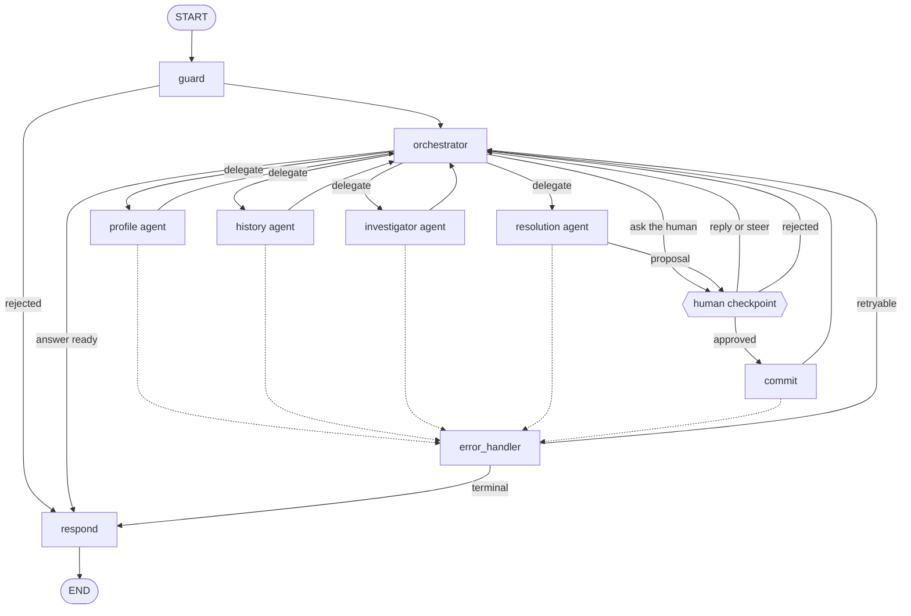
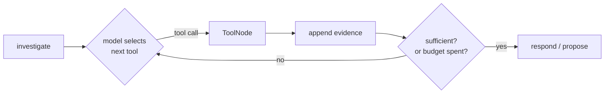

# 05 — LangGraph orchestration

> **Status:** Approved — 2026-08-22
> **Satisfies:** REQ-002, REQ-003, REQ-010–017, REQ-020–023, REQ-090, REQ-091
> **Depends on:** [03 — Architecture](03-architecture.md), [04 — Data model](04-data-model.md)

## 1. Purpose

Specifies the graph: its state, nodes, routing, tool surface, human-in-the-loop gates,
and error handling. This is the component the requirements emphasise most, and the six
capabilities it asks to see demonstrated (REQ-012–017) are each called out where they
are realised.

## 2. Scope

**In scope:** state schema and reducers, node inventory, conditional routing, the tool
surface, HITL interrupt/resume, retry and error strategy, model binding, prompt
structure, testing approach.

**Out of scope:** HTTP transport ([06](06-backend-api.md)), SQL ([04](04-data-model.md)),
retrieval internals ([13](13-vector-search.md)), running it locally ([14](14-local-dev.md)).

---

## 3. Design

### 3.1 Shape of the graph — orchestrator and specialists

A **supervisor topology**: one orchestrator owns the conversation and delegates to
specialist agents, each defined by a skill ([17](17-agent-skills.md)) rather than by
code. Specialists always report back to the orchestrator; they never hand off to each
other and never talk to the user directly.



| Agent | Skill | Owns |
|---|---|---|
| `orchestrator` | `orchestrator` | Conversation, delegation, synthesis, deciding when to involve the human |
| `profile` | `profile` | Customer identity, policies — deterministic tool sequence |
| `history` | `history` | Interaction retrieval and summarisation |
| `investigator` | `investigator` | Bounded agentic loop over claims, cases, interactions, KB |
| `resolution` | `resolution` | Drafts ticket and escalation proposals. **Cannot write** |

Four properties that make this topology worth its complexity:

- **Context isolation.** The investigator's loop can burn thirty tool results without
  polluting the orchestrator's context, because only its *report* returns. This is the
  main reason to use subagents at all — not parallelism, but keeping the conversational
  agent's window clean across a long session.
- **Per-agent capability scoping.** Each skill declares its own `tools` list. The
  profile agent physically cannot call `search_kb`; the resolution agent physically
  cannot write. Capability is bounded by configuration, not by instruction.
- **One writer.** Every mutation funnels through `human` → `commit`. There is exactly
  one place a write can happen and exactly one place to audit, regardless of how many
  agents exist.
- **The human is a node, not a terminus.** `human` is reachable from the orchestrator
  and from `resolution`, and it routes *back* into the conversation. §3.7 explains why
  that matters.

**Delegation is a `Command` handoff**, keeping one shared state rather than marshalling
between separate graphs:

```python
def orchestrator(state: AgentState, config: RunnableConfig) -> Command:
    decision = ...   # model picks from tier-1 skill descriptions — docs/17 §3.5
    return Command(
        goto=decision.agent,
        update={"active_agent": decision.agent, "delegation_brief": decision.brief},
    )
```

The `delegation_brief` matters: a specialist sees the brief and the shared evidence,
never the raw conversation. It cannot be steered by text a customer wrote into a
transcript three turns ago.

### 3.2 State  *(REQ-012)*

```python
from typing import Annotated, Literal, TypedDict
from langgraph.graph.message import add_messages

Intent = Literal[
    "customer_lookup", "interaction_review", "case_investigation",
    "ticket_creation", "escalation", "smalltalk", "unknown",
]

class AgentState(TypedDict):
    # Conversation — append-only via LangGraph's built-in reducer
    messages: Annotated[list[AnyMessage], add_messages]

    # Routing
    intent: Intent | None
    intent_confidence: float

    # Conversational focus. Set once, carried across turns, which is what lets
    # "create a ticket for this issue" resolve without repeating the customer.
    subject_customer_id: str | None
    focus_case_id: str | None
    focus_claim_id: str | None

    # Grounding: every fact the answer may assert. Append-only.  (REQ-090)
    evidence: Annotated[list[Evidence], append_evidence]

    # Delegation — which specialist is active and what it was asked to do
    active_agent: str | None
    delegation_brief: str | None
    agent_reports: Annotated[list[AgentReport], add]

    # Human interaction — one pending ask at a time, any of four kinds (§3.7)
    pending_ask: HumanAsk | None
    human_reply: dict | None
    proposal: Proposal | None
    approval: ApprovalDecision | None
    preferences: dict[str, bool]     # thread-scoped, e.g. skip_confirm_wide_reads

    # Failure handling
    error: ToolError | None
    attempts: Annotated[dict[str, int], merge_attempt_counts]
```

**Evidence is the grounding mechanism.** Every tool result is appended as an
`Evidence` record — source tool, arguments, result, and a stable `ref` such as
`interaction:INT-00027311`. The `respond` node is prompted to answer *only* from
`state.evidence` and to cite the `ref` of anything it asserts. If the evidence list is
empty, the honest answer is that nothing was found. This is what makes REQ-090
enforceable rather than aspirational.

```python
class Evidence(TypedDict):
    ref: str            # "customer:CUST-004217"
    source: str         # tool name
    args: dict
    result: dict
    at: str             # ISO-8601 UTC
```

**Custom reducers**, because the defaults are wrong for these fields:

| Field | Reducer | Why |
|---|---|---|
| `messages` | `add_messages` | LangGraph built-in; handles IDs and updates |
| `evidence` | `append_evidence` | Appends and de-duplicates by `ref` — a re-fetched customer must not appear twice and inflate context |
| `attempts` | `merge_attempt_counts` | Per-node counters summed, so a retry budget survives a loop back through `classify` |
| everything else | last-write-wins | Default |

**Runtime context is not state.** The actor and trace ID are passed through
`config["configurable"]`, never in `AgentState` — they are properties of the *caller*,
not of the conversation, and putting them in state would checkpoint them and let a
resumed run inherit a stale identity.

```python
config = {"configurable": {
    "thread_id": thread_id,
    "actor": {"sub": ..., "email": ..., "groups": [...]},
    "trace_id": trace_id,
}}
```

This matters for security: on resume, the **resuming** actor's claims are read from
config and re-checked (§3.7), so an approval cannot inherit the proposer's authority.

### 3.3 Nodes

| Node | Kind | Skill | Responsibility |
|---|---|---|---|
| `guard` | deterministic | — | Length and shape validation, injection heuristics, cheap authorisation precheck. Rejects without spending a model call |
| `orchestrator` | model | `orchestrator` | Owns the conversation. Classifies, delegates, absorbs specialist reports, decides when to involve the human, decides when it has enough to answer |
| `profile` | deterministic | `profile` | `search_customer` → `get_customer` → `list_policies` |
| `history` | deterministic + model | `history` | Retrieve interactions, then summarise |
| `investigator` | agentic loop | `investigator` | Bounded tool-calling loop over claims, cases, interactions, KB |
| `resolution` | model | `resolution` | Drafts a ticket or escalation `Proposal` via template. **Never writes** |
| `human` | deterministic | — | `interrupt()` — one of four ask kinds (§3.7) |
| `commit` | deterministic | — | Authorise → mutate → audit, in one transaction. The only writer |
| `respond` | model | `orchestrator` | Composes the grounded, cited answer |
| `error_handler` | deterministic | — | Classifies the error and chooses retry / degrade / surface |

Specialists are **subgraph nodes over shared state**, not separate graphs. They read
`delegation_brief` and the shared `evidence`, append their own findings, and return an
`AgentReport` to the orchestrator. They never see the raw message history, which is
both a context saving and an injection boundary.

### 3.4 Conditional routing  *(REQ-011, REQ-013)*

`classify` returns a structured object rather than free text:

```python
class Classification(BaseModel):
    intent: Intent
    confidence: float = Field(ge=0.0, le=1.0)
    customer_hint: str | None = None    # name, email, or ID mentioned
    case_hint: str | None = None
    rationale: str
```

Routing then applies rules the model does not get a vote on:

```python
def route_intent(state: AgentState) -> str:
    if state["error"]:
        return "error_handler"
    # Low confidence never silently guesses a workflow.
    if state["intent_confidence"] < 0.6:
        return "clarify"
    # A mutation with no established subject is a non-starter.
    if state["intent"] in ("ticket_creation", "escalation") \
            and not state["subject_customer_id"]:
        return "clarify"
    return INTENT_TO_NODE[state["intent"]]
```

Two guards worth stating explicitly, because both are places a naive implementation
goes wrong:

- **Low confidence routes to `clarify`, not to a best guess.** Asking "did you mean
  the claim or the policy?" costs one turn. Investigating the wrong thing costs trust.
- **`ticket_creation` requires a subject.** *"Create a ticket for this issue"* is only
  meaningful with `subject_customer_id` already in state from an earlier turn — which
  is exactly the reference scenario sequence (REQ-020 → REQ-022 → REQ-023).

There are three further conditional edges: `lookup → clarify | respond` on match
count, `investigate → investigate | respond | ticket_propose` on sufficiency, and
`approval_gate → commit | respond` on the decision.

### 3.5 Multi-step workflow — investigation  *(REQ-014, REQ-022)*

*"Customer reports a failed claim submission. Help me investigate the issue."*

A bounded loop, not an open-ended agent. The model chooses tools; the graph enforces
the budget and the stopping rule.



Typical trace for the seeded scenario:

1. `search_customer("John Tan")` → one match, `CUST-004217`
2. `list_claims(customer_id, status="submission_failed")` → `CLM-00184402`,
   `failure_code = DOC_UNREADABLE`
3. `list_interactions(customer_id, limit=5)` → two prior contacts on the same claim
4. `search_kb("DOC_UNREADABLE")` → `KB-0031`, the remediation article
5. Sufficiency reached → `respond` with a grounded finding and a suggested next action

Bounds, all enforced by the graph rather than requested of the model:

| Bound | Value | Rationale |
|---|---|---|
| Max tool-calling iterations | 6 | Above this, the model is thrashing, not investigating |
| Max tool calls per iteration | 3 | Parallel fan-out is useful; unbounded fan-out is not |
| Distinct tools before forced summarise | 5 | Prevents re-querying the same tool with tweaked arguments |
| Wall-clock budget | 45 s | Keeps a streamed response interactive |

On exhausting the budget, the graph does **not** fail. It routes to `respond` with the
evidence gathered and says the investigation was incomplete — a partial, honest answer
beats a timeout.

### 3.6 Model-driven vs deterministic

| Intent | Style | Why |
|---|---|---|
| `customer_lookup` | Deterministic | The plan is known. Cheaper, faster, cannot go wrong |
| `interaction_review` | Deterministic fetch + model summarise | Retrieval is mechanical; summarisation is not |
| `case_investigation` | Agentic loop | The plan depends on what is found |
| `ticket_creation` | Model drafts, human approves, code writes | Judgement is the model's; authority is not |

This split *is* the workflow-orchestration answer to REQ-017: the graph decides
**what kind of thinking** each request needs, rather than routing everything through
one general agent loop.

### 3.7 Human-in-the-loop — four kinds, not one gate  *(REQ-015, REQ-091, REQ-097)*

If the only human touchpoint is an approval modal, the product stops being a
conversation and becomes a form with a chat skin. The agent should be able to *ask*,
and the human should be able to *interject*, at any point — that is what keeps the
interaction feeling like working with a colleague.

So `human` is a single node reached with four different intents, all built on the same
durable `interrupt()`:

| Kind | Raised when | Human responds with | Blocking? |
|---|---|---|---|
| `clarify` | Genuine ambiguity — two customers named John Tan; "this issue" with no antecedent | Free text, or picks an option | Yes |
| `confirm` | Expensive or wide-reaching read before committing to it — "shall I pull all 40 interactions?" | Yes / no / narrower scope | Yes, and skippable |
| `approve` | A mutation is proposed — ticket, escalation | Approve / reject, plus an optional note | **Yes, always** |
| `steer` | The human volunteers a correction mid-run — "actually check the motor policy" | Free text | No — drains at the next node boundary |

```python
from langgraph.types import interrupt, Command

def human_checkpoint(state: AgentState, config: RunnableConfig) -> dict:
    ask = state["pending_ask"]                 # HumanAsk, built by the caller
    reply = interrupt({
        "kind": ask["kind"],                   # clarify | confirm | approve | steer
        "question": ask["question"],           # rendered from a skill template
        "options": ask.get("options"),         # optional — a choice, not a form
        "payload": ask.get("payload"),         # populated for `approve`
        "evidence_refs": [e["ref"] for e in state["evidence"]],
        "skippable": ask["kind"] in ("confirm",),
    })
    return {"human_reply": reply, "pending_ask": None}
```

The resume payload is **free-form, not a boolean**, which is the difference between a
conversation and a form:

```python
Command(resume={"kind": "clarify", "text": "the second one, the motor policy"})
Command(resume={"kind": "approve", "approved": True, "note": "confirmed on call"})
Command(resume={"kind": "confirm", "approved": False, "text": "just the last 5"})
```

#### Keeping it non-rigid

Five rules, each aimed at a specific way conversational agents go stiff:

1. **The human can always just talk.** A reply that does not fit the expected shape is
   not an error — it is routed back to the orchestrator as a normal turn with the
   pending ask still in scope. Answering "who handled the last call?" to a
   disambiguation prompt gets an answer, then the disambiguation is asked again.
2. **`confirm` is skippable and remembered.** "Don't ask me that again" sets a
   thread-scoped preference and the checkpoint stops firing for that thread. An agent
   handling forty calls a day should not be asked the same question forty times.
3. **Steering is honoured mid-flight.** A message arriving while the graph is running
   is queued and drained at the next node boundary. The orchestrator sees it as a
   `steer` and may abandon the current line of work. The alternative — ignoring the
   human until the agent finishes — is exactly the rigidity to avoid.
4. **Approval is never the *only* thing that happens.** The proposal arrives with the
   reasoning and the evidence that produced it, and rejection routes back into
   conversation ("what should I change?"), not to a dead end.
5. **Checkpoints are declared in skills, not hardcoded.** Each skill's
   `human_checkpoints` frontmatter states when it wants a human ([17](17-agent-skills.md)
   §3.4). Tuning how chatty an agent is, is a Markdown edit.

#### Enforced versus advisory

The distinction that keeps this safe:

| Kind | Status | Why |
|---|---|---|
| `approve` | **Enforced in code** | A mutation without approval must be unrepresentable. Not a prompt instruction |
| `clarify`, `confirm`, `steer` | Advisory — skill-declared, model-invoked | Over-enforcing these is what produces the interrogation feel |

#### Durability and authorisation

- **The pause is a checkpoint, not a held connection.** The SSE stream closes; the
  browser can be refreshed and the ECS task replaced; the pending ask still resolves
  against persisted state (REQ-091).
- **Authorisation happens at `commit`, on the resuming actor.** `create_ticket` needs
  group `agent`; `escalate_case` needs `supervisor`. The proposer's identity does not
  carry over.
- **The payload shown is the payload written.** `commit` writes `proposal.payload`
  verbatim, rendered from the same template the human saw ([17](17-agent-skills.md)
  §3.6). The model is not consulted between approval and write, so it cannot alter what
  was agreed.
- **Every outcome is audited** — approved, rejected, and denied-for-permissions alike.

### 3.8 Tool surface

Tools are business operations, not database accessors. The model never sees SQL, table
names, or joins.

| Tool | Mutates | Authorisation | Notes |
|---|---|---|---|
| `search_customer(query)` | no | authenticated | Name / email / ID. Returns **all** matches |
| `get_customer(customer_id)` | no | authenticated | Includes policies |
| `list_interactions(customer_id, limit, since)` | no | authenticated | Summaries by default, not transcripts |
| `search_interactions(customer_id, query)` | no | authenticated | Semantic — [13](13-vector-search.md); degrades to keyword |
| `list_claims(customer_id, status)` | no | authenticated | |
| `get_claim(claim_id)` | no | authenticated | Includes `failure_code`, `failure_detail` |
| `list_cases(customer_id, status)` | no | authenticated | |
| `get_case(case_id)` | no | authenticated | Includes case events |
| `search_kb(query)` | no | authenticated | Remediation articles |
| `create_ticket(...)` | **yes** | group `agent` | Reachable only via `commit` |
| `escalate_case(...)` | **yes** | group `supervisor` | Reachable only via `commit` |

Contract for every tool:

```python
class ToolResult(BaseModel, Generic[T]):
    ok: bool
    data: T | None = None
    error: ToolError | None = None
```

**A tool never raises into the graph.** It catches, classifies, and returns. A raised
exception would abort the run and discard evidence already gathered; a returned error
is a value the graph can route on and the model can be told about.

Mutating tools are **not bound to the model at all**. They are invoked only from
`commit`, after an interrupt. There is therefore no prompt that can talk the model into
writing a ticket directly — the capability is absent, not merely discouraged.

### 3.9 Model binding

```python
llm = ChatGoogleGenerativeAI(
    model="gemini-3.5-flash",           # docs/02 §3.1
    google_api_key=settings.gemini_api_key.get_secret_value(),
    temperature=0.0,                     # classification and grounding
    max_output_tokens=2048,
    timeout=30,
    max_retries=0,                       # the graph owns retries, not the client
)
```

- **One adapter module** (`services/llm.py`) constructs every model handle. Swapping to
  Bedrock ([ADR-001](adr/ADR-001-llm-provider.md)) or Vertex AI touches this file only.
- `temperature=0.0` for `guard`, `classify`, and `commit`-adjacent reasoning; `0.3` for
  `respond` and summarisation, where some fluency helps and nothing factual depends on
  sampling.
- `max_retries=0` on the client is deliberate — retry policy lives in `error_handler`
  where it can be observed, budgeted, and tested.

### 3.10 Prompt assembly

**No prompt text appears in this codebase's Python.** Every system prompt, routing
policy, and output format lives in a versioned skill directory —
[17 — Agent skills](17-agent-skills.md) — and the rule is enforced by a CI check that
fails on long string literals under `app/graph/` and `app/agents/`.

At runtime each agent's prompt is assembled in order of stability, so the cacheable
prefix stays byte-identical across turns:

| Layer | Source | Stability |
|---|---|---|
| 1. System | The active skill's `SKILL.md` body | Frozen per deploy |
| 2. Tool descriptions | Tool registry, filtered to the skill's `tools` list, deterministic order | Frozen per deploy |
| 3. Skill menu *(orchestrator only)* | Tier-1 `description` of every skill | Frozen per deploy |
| 4. References | Loaded on demand by the running agent | Per turn |
| 5. Turn | Delegation brief, user message, serialised `evidence` | Per turn |

Everything volatile sits after the last stable layer. Nothing interpolates a timestamp
or a request ID into layers 1–3, because that would invalidate the prefix on every call.

The grounding rule lives in `skills/*/SKILL.md` under `## Grounding` and is the
load-bearing instruction ([00](00-constitution.md) §6): answer only from the evidence
block, cite the `ref` of every record mentioned, and say plainly when the evidence does
not contain the answer.

### 3.11 Failure handling  *(REQ-016)*

Errors are classified, and the class determines the response:

| Class | Examples | Strategy | Budget |
|---|---|---|---|
| `transient` | Gemini 5xx, connection reset, `SQLITE_BUSY` | Retry with jittered exponential backoff | 2 per node |
| `rate_limited` | Gemini 429 | Honour `Retry-After`, then surface a wait message | 1 |
| `not_found` | Unknown customer or claim | No retry — surface plainly | 0 |
| `invalid_input` | Malformed ID, failed validation | No retry — ask the human to restate | 0 |
| `forbidden` | Missing group for a mutation | No retry — explain the missing permission, audit `denied` | 0 |
| `budget_exceeded` | Iteration or time bound hit | Summarise what was found; say it is partial | 0 |
| `internal` | Anything unclassified | Surface a generic failure with the `trace_id` | 0 |

```python
def handle_error(state: AgentState) -> str:
    err = state["error"]
    if err["class"] in ("transient", "rate_limited") \
            and state["attempts"].get(err["node"], 0) < RETRY_BUDGET[err["class"]]:
        return "retry"
    return "surface"
```

Plus a node-level `RetryPolicy` on model-calling nodes as a second layer for pure
transport faults.

**Degradation is preferred to failure.** If semantic search is unavailable, keyword
search runs instead and the answer notes reduced recall. If the model fails during
`respond` but evidence was gathered, the evidence is rendered as a plain structured
summary. The user is told the difference in every case — a silently degraded answer is
a correctness bug, not a resilience feature.

### 3.12 Testing

| Level | What is tested | How |
|---|---|---|
| Unit | Reducers, routing predicates, tool validation | Pure functions, no I/O |
| Graph | Node sequences per intent | `MemorySaver` + a stub model returning scripted tool calls |
| HITL | Interrupt → resume, approve and reject | Assert `__interrupt__`, resume with `Command`, assert the write and the audit row |
| Failure | Each error class | Fault-injecting fake tools |
| Grounding | No uncited assertions | Assert every ID in the answer appears in `evidence` |
| Integration | Real Gemini, real SQLite | Marked `@pytest.mark.live`, opt-in, excluded from CI by default |

The stub model is what makes the suite deterministic and offline. `build_graph` takes
the model as a parameter for exactly this reason — same rule as the checkpointer
([00](00-constitution.md) §7).

---

## 4. Decisions and tradeoffs

| Decision | Alternative | Rationale |
|---|---|---|
| Orchestrator + specialists | One flat graph with intent nodes | Context isolation: a specialist can burn thirty tool results without polluting the conversational agent's window. Also gives per-agent capability scoping |
| Specialists report back; no peer handoff | Free handoff between agents | A star topology has one place to audit and cannot form delegation cycles |
| Subgraph nodes over shared state | Independent graphs with marshalling | One evidence trail, one checkpoint, no serialisation boundary to keep in sync |
| Behaviour in skill files | Prompts as Python literals | Reviewable diffs, independent versioning, hot reload, progressive disclosure. [17](17-agent-skills.md) |
| Four HITL kinds, one node | A single approval gate | A single gate makes the product a form with a chat skin. §3.7 |
| Free-form resume payload | Boolean approve/reject | An off-script human reply is a conversation, not a validation error |
| `approve` enforced, others advisory | Enforce every checkpoint | Over-enforcing clarify/confirm produces an interrogation; under-enforcing approve produces an unauthorised write |
| Explicit graph over `create_react_agent` | Prebuilt ReAct agent | The requirements ask to *see* state, routing, multi-step, and HITL. A prebuilt agent hides all four |
| Deterministic nodes for simple intents | Everything through a ReAct loop | Cheaper, faster, and cannot mis-plan a lookup |
| Mutating tools unbound from the model | Bind with a "please confirm first" instruction | Absence of capability beats instruction to not use it |
| `evidence` as an explicit state field | Rely on message history | Makes grounding testable — assertions run against a list, not prose |
| Interrupt at a dedicated node | Interrupt inside each mutating tool | One gate, one audit point, one resume contract |
| Actor in config, not state | Actor in `AgentState` | Prevents a resumed run inheriting a stale identity |
| Bounded investigation loop | Unbounded until the model stops | Predictable latency and cost; forced honesty about partial results |
| Retries in the graph, not the client | `max_retries` on the LLM client | Observable, testable, and budgeted per node |

## 5. Failure modes

| Failure | Detection | Behaviour |
|---|---|---|
| Model returns an unparseable classification | Pydantic validation | Retry once at `temperature=0`; then route to `clarify` |
| Model hallucinates a tool name | LangChain tool binding | Rejected before dispatch; loop continues with the error as context |
| Model invents a customer ID | Pattern + existence check in the tool | `not_found`; assistant states it plainly |
| Investigation loop oscillates | Distinct-tool counter | Forced summarise at 5 distinct tools |
| Approval never arrives | — | Thread stays interrupted indefinitely. Acceptable; no timeout in scope |
| Duplicate resume for one interrupt | Checkpoint already advanced | Second resume is a no-op; API returns `409` |
| Checkpointer write fails | Exception at node boundary | Run fails closed; the turn is not silently lost |
| Answer cites a `ref` not in evidence | Grounding test in CI | Build fails. Runtime behaviour is best-effort prompt adherence |

## 6. Open questions

1. **Is `guard` worth a model call for injection detection?** Currently heuristic-only
   (length, control characters, known jailbreak markers). A model-based classifier adds
   latency and cost to every turn. Leaning: keep heuristics, revisit if the demo shows
   real injection attempts mattering.
2. **Should `interaction_review` always use semantic search?** Vector search is the
   nice-to-have and may ship disabled. Current plan: keyword by default, semantic when
   the flag is on, and the answer says which was used.
3. **Multi-customer threads.** If an agent switches customers mid-thread,
   `subject_customer_id` changes but stale `evidence` remains. Proposal: clear evidence
   on subject change. Needs confirmation that it does not break the
   lookup → investigate → ticket sequence.
4. **Streaming granularity.** `astream_events` gives token-level detail but a chatty
   event stream. Proposal: stream node-level progress plus final-message tokens only.
