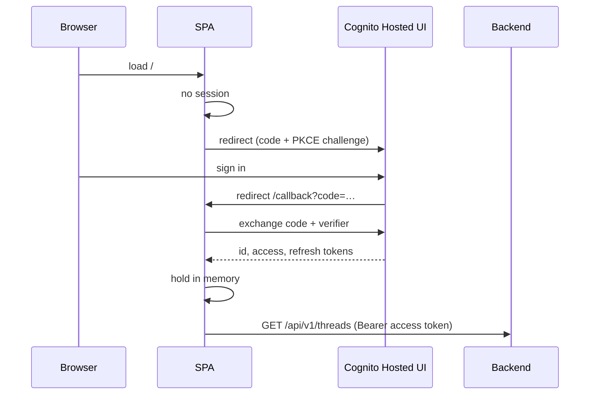

# 07 — Frontend

> **Status:** Approved — 2026-08-22
> **Satisfies:** REQ-001, REQ-006, REQ-015 (approval UI), REQ-060
> **Depends on:** [03 — Architecture](03-architecture.md), [06 — Backend API](06-backend-api.md), [21 — Design system](21-design-system.md)

## 1. Purpose

The web interface support agents use to work with the assistant: layout, state
management, authentication flow, streaming rendering, and the approval interaction.

## 2. Scope

**In scope:** stack, screens, component structure, client state, OIDC/PKCE flow, SSE
consumption, approval UX, accessibility, build and container packaging.

**Out of scope:** the HTTP contract ([06](06-backend-api.md)), infrastructure
([08](08-infrastructure.md)), and the visual design system — tokens, components,
typography, motion, and the responsive rules now live in
[21 — Design system](21-design-system.md), which this document defers to.

---

## 3. Design

### 3.1 Stack

| Concern | Choice | Rationale |
|---|---|---|
| Framework | React 19 | Requested; the assistant is a single interactive surface, not a content site |
| Build | Vite 7 + TypeScript strict | Fast, no SSR machinery we do not need |
| Routing | React Router | **The thread is a route** — `/threads/:threadId` ([§3.10](#310-addressable-conversations)) |
| Server state | TanStack Query | Caching, retries, invalidation, and cursor pagination for the thread list |
| Streaming | `fetch` + `ReadableStream` SSE parser | `EventSource` cannot send an `Authorization` header |
| Auth | `oidc-client-ts` | Authorization Code + PKCE against Cognito ([§3.4](#34-authentication-flow)) |
| Styling | Tailwind CSS v4, CSS-first tokens | The design system is expressed as tokens, not a config file ([21](21-design-system.md) §4.1) |
| Components | shadcn/ui-style primitives + Radix | Source-in-repo, so they are edited to fit the tokens ([21](21-design-system.md) §4.3) |
| Icons | `lucide-react` | One consistent set, tree-shaken |
| Motion | `framer-motion` | Enter/exit animation for a list that changes mid-stream ([21](21-design-system.md) §4.6) |
| Prose | `react-markdown` + `remark-gfm`, **no raw HTML** | The agent writes Markdown; rendering it as markup would be an injection path |
| Testing | Vitest + Testing Library, Playwright | Component, hook, and browser tests — desktop **and** phone |
| Serving | nginx `stable-alpine` | Static files + SPA fallback, ~10 MB image |

**No Next.js.** There is no SSR, SEO, or server-component requirement — every view is
behind authentication and driven by streaming state. Next.js would add a Node runtime
and a second server process to operate for no functional gain
([ADR-003](adr/ADR-003-frontend-runtime.md)).

### 3.2 Layout

Three regions on a wide screen; on anything narrower the conversation takes the whole
screen and the two rails become sheets reached from the header. The full breakpoint
behaviour, and why it transforms rather than compresses, is
[21](21-design-system.md) §4.5.

```
┌──────────────────────────────────────────────────────────────────┐
│ ▤  CCOA  Failed claim — John Tan        dev auth  agent@…  Out  │
├────────────┬─────────────────────────────────┬───────────────────┤
│ Threads    │  Conversation                   │  Context          │
│            │                                 │                   │
│ + New      │  ┌───────────────────────────┐  │  CUST-000042      │
│            │  │ Show me the details for   │  │  John Tan         │
│ ▸ John Tan │  │ customer John Tan.        │  │  [gold] [active]  │
│   2m ago   │  └───────────────────────────┘  │  Tampines         │
│ ▸ Priya S. │                                 │                   │
│   1h ago   │  ✓ Assistant activity · 5 look… │  POLICIES (2)     │
│            │                                 │  POL-00000081     │
│ Load older │  PROFILE DETAILS                │  health           │
│            │  • Email: john.tan.42@…         │  active · $2,750  │
│            │  • Status: Active               │                   │
│            │  ───────────────────────────    │  CASES (1)        │
│            │  SOURCES ⧉CUST-000042 ⧉POL-…    │  CASE-000008      │
│            │                                 │  claim failure    │
│            │  ┌───────────────────────────┐  │                   │
│            │  │ Ask about a customer…  ↑  │  │  RECENT CONTACTS  │
│            │  └───────────────────────────┘  │  …                │
│            │  The assistant interprets rec…  │                   │
└────────────┴─────────────────────────────────┴───────────────────┘
```

| Region | Contents |
|---|---|
| **Threads** | The agent's conversations, newest activity first; new-thread action; "Load older" ([§3.10](#310-addressable-conversations)) |
| **Conversation** | Message history, live step/tool progress, streamed answer, citation chips, composer |
| **Context** | Auto-populated from `subject_customer_id`: customer, policies, open cases, recent interactions |

The context panel is what makes this an *operations tool* rather than a chatbot. When
the agent asks about John Tan, the panel fills in — so the human can verify the
assistant's claims against the same records, side by side. A citation chip focuses the
record it names; on a phone it also opens the context sheet, because highlighting a record
behind a closed panel helps nobody.

### 3.3 Component tree

```
App                             routing + the authentication gate
├── AuthProvider                OIDC session, silent renew, token access
└── AssistantLayout             /threads/:threadId
    ├── AppHeader               brand, active thread, identity, panel toggles
    ├── ThreadSidebar           rail at lg, Sheet below — cursor-paginated
    ├── MessageList
    │   ├── (user turn)         plain text, exactly as typed
    │   ├── (assistant turn)    Markdown + CitationChip[]
    │   ├── ActivityTrail       live step/tool progress, labelled as activity
    │   ├── (draft)             streamed tokens + caret, dashed border
    │   └── ApprovalCard        the HITL checkpoint, all four ask kinds
    ├── Composer                auto-growing, safe-area aware
    └── ContextPanel            rail at lg, Sheet below
```

Each rail is mounted **once**, in whichever region currently holds it — see
[21](21-design-system.md) §4.5 for why `hidden lg:block` was the wrong mechanism.

### 3.4 Authentication flow

Authorization Code + PKCE against the Cognito Hosted UI. No client secret — the SPA is
a public client and cannot keep one.



Token handling rules:

- **Access and ID tokens live in memory only.** Not `localStorage`, not
  `sessionStorage` — both are readable by any injected script.
- The refresh token is held by `oidc-client-ts` and silent renew runs on a hidden
  iframe before expiry. A hard reload re-runs the redirect flow; this is a one-second
  cost on refresh and is the right trade against persisting a credential.
- **No token is ever logged**, and none appears in a URL after the callback is
  consumed — the SPA rewrites history immediately.
- On `401`, one silent renew is attempted; on failure, redirect to sign-in.

Group claims (`cognito:groups`) are read for **display only** — hiding an approve
button the user cannot use. Every real decision is the backend's
([03](03-architecture.md) §3.2).

#### Two Cognito facts the standard flow does not cover

1. **The endpoints are declared, not discovered.** A pool's OIDC metadata is served from
   `cognito-idp.<region>.amazonaws.com`, but the authorize and token endpoints live on the
   *hosted UI domain* — a separate resource that may not exist when the pool is created, or
   may be added later. Relying on discovery makes sign-in fail with an unhelpful error
   whenever it is absent. `src/auth/cognito.ts` builds them from the domain the server
   reports, which also removes a metadata round-trip before the redirect.
2. **Cognito has no `end_session_endpoint`.** It exposes `/logout`, which takes `client_id`
   and `logout_uri` rather than the OIDC `id_token_hint` and `post_logout_redirect_uri`.
   `UserManager.signoutRedirect()` therefore throws outright, and sign-out is built by
   hand. The local session is cleared **before** the redirect: reversed, the redirect wins
   the race and the session survives a sign-out that appeared to work.

The domain may be reported as a prefix, a host, or a full URL — the console shows a
different one on each page — and all three are normalised. Treating a bare prefix as a host
produces `https://ccoa-dev`, which sends the agent to a browser error page instead of a
login form. `src/auth/cognito.test.ts` pins all of this, because none of it can be
exercised without a real pool and every mistake surfaces only in a deployed environment.

#### Running against a real pool from a laptop

`AUTH_MODE=dev` exists so the local loop does not need Cognito at all, and the backend
refuses to start with it outside `ENVIRONMENT=local` ([14](14-local-dev.md) §3.7).

But the full flow **does** work locally, the same way a Google sign-in works against an app
running on a developer machine: Cognito permits `http://localhost` callback URLs
specifically so a SPA can be developed against real identities. Nothing in the SPA branches
on hostname — `redirect_uri` is always `${window.location.origin}/callback`, and the only
requirement is that the exact URL is registered on the app client.
[18](18-aws-access-and-manual-steps.md) §7 is the runbook, with both a CLI and a console
path.

The SPA learns which mode it is in from the public `GET /api/v1/config`, rather than from a
build-time flag. That endpoint is unauthenticated by necessity — a browser cannot ask an
authenticated endpoint which identity provider to authenticate against — and returns
nothing secret ([06](06-backend-api.md) §3.2).

### 3.5 Consuming the stream

`EventSource` cannot attach an `Authorization` header, so the SPA uses `fetch` with a
`ReadableStream` and a small SSE parser.

```ts
export async function streamMessage(
  threadId: string, content: string, token: string,
  on: StreamHandlers, signal: AbortSignal,
) {
  const res = await fetch(`/api/v1/threads/${threadId}/messages`, {
    method: "POST",
    headers: { "Content-Type": "application/json", Authorization: `Bearer ${token}` },
    body: JSON.stringify({ content }),
    signal,
  });
  if (!res.ok) throw await problemDetail(res);
  for await (const ev of parseSSE(res.body!)) {
    switch (ev.event) {
      case "step":               on.step(ev.data); break;
      case "tool":               on.tool(ev.data); break;
      case "token":              on.token(ev.data.text); break;
      case "message":            on.message(ev.data); break;
      case "approval_required":  on.approval(ev.data); break;
      case "error":              on.error(ev.data); break;
      case "done":               on.done(ev.data.status); return;
    }
  }
}
```

Rendering rules:

- **Steps and tools render as a collapsing activity trail**, not as chat messages.
  Expanded while running, collapsed to a one-line summary when the answer arrives —
  visible enough to build trust, quiet enough not to bury the answer.
- **Tokens append to a draft bubble**; the terminal `message` event replaces it with
  the canonical content plus citations. The stream is a preview; the event is truth.
- **Citations are chips.** Clicking `[CUST-004217]` focuses that record in the context
  panel. This is the grounding contract ([05](05-langgraph-orchestration.md) §3.2)
  made visible: every claim is one click from its source.
- `AbortController` on unmount or navigation, which cancels the run server-side.

### 3.6 Approval interaction  *(REQ-015)*

An `approval_required` event renders an `ApprovalCard` inline where the answer would be:

```
┌────────────────────────────────────────────────────────┐
│ ⚠  Approval required — Create support ticket           │
├────────────────────────────────────────────────────────┤
│ Customer   John Tan (CUST-004217)                      │
│ Case       CASE-000412                                 │
│ Title      Claim CLM-00184402 submission failed        │
│ Category   claim_issue        Priority  high           │
│                                                        │
│ Description                                            │
│   Document upload rejected as unreadable on three      │
│   attempts. KB-0031 remediation not yet applied.       │
│                                                        │
│ Based on  [CUST-004217] [CLM-00184402] [KB-0031]       │
│                                                        │
│ Note (optional) ┌────────────────────────────────────┐ │
│                 └────────────────────────────────────┘ │
│                            [ Reject ]  [ Approve ]     │
└────────────────────────────────────────────────────────┘
```

- The card shows the **exact payload** that will be written — not a paraphrase.
- `Approve` is disabled, with a tooltip, if the user's groups lack the required
  permission. The backend re-checks regardless.
- Both buttons `POST /resume` and re-enter the stream.
- The thread is **durable while pending**: a refresh re-reads `/state` and re-renders
  the same card. Closing the browser does not lose the decision point.
- Once submitted, the card locks into a decided state — no double-submit, and `409`
  from a duplicate is handled as "already decided" rather than an error.

### 3.7 Client state

| State | Owner | Persistence |
|---|---|---|
| Auth session | `AuthProvider` | Memory + `oidc-client-ts` |
| Thread list, customer/case/interaction reads | TanStack Query | Cache, `staleTime` 30 s |
| Active stream (steps, tools, draft tokens) | `useReducer` in `useConversation` | Ephemeral |
| Composer draft | Local component state | Ephemeral |
| **Which conversation is open** | **The URL** | The router ([§3.10](#310-addressable-conversations)) |

No Redux or Zustand. Server state belongs to Query; stream state is one reducer with a
short life. A global store would be ceremony around two concerns that do not overlap.

### 3.6a Where a free-text answer is typed

A checkpoint that offers options is answered by clicking one. A checkpoint that does not —
and `clarify` frequently does not — is answered **in the composer**, not in an input inside
the card.

The card briefly had its own text box, and it was wrong twice over. It duplicated the
composer sitting a few pixels below it, so the screen showed two identical inputs, one of
which resolved the question and one of which did not. And when the graph offered no
options it was the *only* control in the card, which made a conversational checkpoint look
like a form.

Underneath that was a real defect. While a checkpoint is open the graph is suspended on
`interrupt()` and `state.streaming` is `false`, so the composer was **enabled** — typing
there posted to `/messages` on a blocked thread. It now either answers the checkpoint or is
disabled, and never posts into a suspended graph.

| Ask kind | Answered by |
|---|---|
| `clarify` with options | a click, or the composer |
| `clarify` without options, `steer` | the composer |
| `confirm`, `approve` | **the card's controls only** |

The last row is the constraint. `approve` and `confirm` are decisions with consequences —
a ticket gets written — so typing "yes" must never satisfy one. The composer stays disabled
for those, and the explicit control is the only route.

While the composer is answering it says so: a label above it, a tinted border, and
"Answer the question above…" in place of the usual placeholder. Enter resolving a
checkpoint rather than starting a new turn is a difference worth showing.

### 3.7a Streaming feedback

The motion vocabulary — what each animation means, and why none of it may be fabricated —
is [21](21-design-system.md) §4.6. Two rules bear repeating here because they are about
honesty rather than style:

- **Every progress row corresponds to an event the backend actually sent.** A spinner on a
  timer is a lie about what the system is doing.
- **The stream is a preview; the `message` event is truth.** Streamed tokens accumulate
  into a visibly provisional draft (dashed border, trailing caret) and the terminal event
  replaces it wholesale, with its citations. Rendering accumulated tokens as the final
  answer would show text the backend never committed to.

### 3.8 Accessibility

- The activity trail is an `aria-live="polite"` region; the final answer is announced
  once, not per token.
- `ApprovalCard` traps focus and is fully keyboard-operable; approve/reject are never
  colour-only distinctions.
- Every icon-only control has an accessible name. Contrast meets WCAG AA.
- Streaming respects `prefers-reduced-motion` — no animated typing when it is set.

### 3.9 Build and container

A `node:22-alpine` build stage, an `nginx:stable-alpine` runtime stage, port 8080, and a
non-root user. ARM64 to match the Fargate task architecture ([02](02-research.md) §6).

- nginx serves static assets, falls back to `index.html` for client routes, sets security
  headers, gzips, and exposes `/healthz` returning 200.
- Hashed assets are cached for a year and immutable; `index.html` is never cached, because
  it is what points at them and a stale copy pins the app to a previous deploy.
- **No build-time secrets.** Runtime configuration is fetched from `/api/v1/config` before
  login and `/api/v1/meta` after it, rather than baked into the bundle — so the same image
  is promotable across environments.
- Fonts are **bundled**, not fetched from a CDN: the CSP sets `font-src 'self'`, which
  blocks Google Fonts silently.
- **`connect-src` names the identity provider.** PKCE exchanges its authorization code by
  POSTing to Cognito's `/oauth2/token` *from the browser*, so `connect-src 'self'` refuses
  it — after the redirect has already succeeded, which makes it look like a network fault
  rather than a policy one. The two Cognito hosts are substituted into the header at
  container start (`docker/25-csp.sh`) from an environment variable the task definition
  supplies; the default stays `'self'`, so an unconfigured image is still locked down.
  Neither host is wildcarded: `https://*.amazonaws.com` would open every AWS endpoint
  there is.

#### The container is verified, not assumed

`frontend/docker/verify-image.sh` runs the image and asserts thirty properties of what it
actually serves. It exists because every defect it checks for was, at some point, present
in a green build:

| Defect | What it looked like |
|---|---|
| Pidfile in a directory the non-root user cannot write | The build succeeded; the container exited on start, serving nothing |
| A `sed` rewriting a path the base image no longer uses | Matched nothing, reported success, and "fixed" nothing |
| `nginx -t` leaving a root-owned pidfile in sticky-bit `/tmp` | The same permission error, one layer further along |
| **`add_header` inside a `location` discarding every inherited header** | **No CSP, no `X-Frame-Options`, no `nosniff` — on any response** — with a clean 200 |
| `expires` alongside `add_header Cache-Control` | Two competing `Cache-Control` headers |

The fourth is the one worth internalising: nginx inherits `add_header` from an enclosing
block **only while the inner block declares none of its own**. All three locations set a
caching header, so all five security headers — declared once at server level, exactly as
they read correctly — reached nothing. Nothing warns; the config tests clean. The headers
now live in an include that every location pulls in, and the script asserts them **per
location**, because passing on one says nothing about the others.

### 3.9a Typing starts a conversation

The empty screen is a working composer. There is no "New conversation" step before the
first message — the button still exists in the rail for starting a *second* conversation,
but nothing requires it.

Sending from the empty state creates the thread, puts its id in the URL, and delivers the
message, in that order. The ordering is not incidental: `useConversation` is keyed by
thread id, and its `/state` load resolves **after** the navigation and resets the reducer.
A message sent before that reset lands is wiped a moment later, with no error — so the hook
exposes `ready`, and the queued message is delivered only once the conversation it belongs
to has finished loading.

Opening `/` therefore always shows an empty conversation rather than the most recent one.
That is the behaviour of every assistant people already use, and it removes the auto-select
effect that used to race an explicit navigation ([§3.10](#310-addressable-conversations)).

### 3.9b One scrolling region

The shell is fixed height — header, rails, composer — with exactly one scrolling region
inside it: the message list.

`html, body, #root` set `overflow: hidden`, which makes that **structural rather than
emergent**. Relying on the flex chain alone means the containment holds only while every
ancestor of the scroller keeps `min-height: 0`; one missing `min-h-0` anywhere lets the
layout grow and carries the header and composer off the screen with it. That is not a
property anyone can maintain by inspection, and `main` was in fact missing it.

Asserted by `e2e/assistant.spec.ts`: with forty messages injected, the document must not be
scrollable and the list must be.

### 3.10 Addressable conversations

The open conversation is a route, `/threads/:threadId`, not a piece of React state.

Two reasons, and the second is the one that mattered in practice:

1. **It is addressable.** A conversation can be bookmarked, reopened after a crash, and
   pasted to a colleague; browser back does what the agent expects instead of leaving the
   application.
2. **It removes a race.** While selection was state, an asynchronous refresh of the thread
   list could overwrite an explicit choice — the visible symptom being a message sent to
   the conversation the agent had just navigated away from. It was patched once with a ref
   guard; making the router the owner removes the class of bug rather than the instance.

The list itself is **cursor-paginated** ([06](06-backend-api.md) §3.2a) via
`useInfiniteQuery`, with a "Load older" control. It stops on a null cursor, never on a
short page.

---

## 4. Decisions and tradeoffs

| Decision | Alternative | Rationale |
|---|---|---|
| React + Vite | Next.js | No SSR/SEO need; avoids operating a Node server. [ADR-003](adr/ADR-003-frontend-runtime.md) |
| nginx container on ECS | S3 + CloudFront (~$1/mo) | The requirements mandate ECS; containerising makes it true of both services |
| `fetch` + stream parser | `EventSource` | `EventSource` cannot send `Authorization` |
| Tokens in memory | `localStorage` | XSS-readable storage for a credential is not defensible for an app handling customer PII |
| PKCE public client | Backend-for-frontend with cookies | BFF is more secure but adds a session store and a third moving part. PKCE + in-memory tokens is the right point on the curve here |
| TanStack Query only | Redux / Zustand | Two disjoint state concerns; no global store earns its keep |
| Runtime config from `/config` and `/meta` | Build-time `VITE_*` | One image, many environments; no rebuild to redeploy |
| Activity trail collapses | Always-visible trace | Trust needs visibility; readability needs quiet |
| Thread in the URL | Thread in React state | Addressable, and it deletes a race rather than patching it ([§3.10](#310-addressable-conversations)) |
| Cursor pagination | Load every thread | The sort key changes under the reader; an offset silently drops rows ([06](06-backend-api.md) §3.2a) |
| Explicit Cognito endpoints | OIDC discovery | Discovery does not reliably carry the hosted-UI endpoints ([§3.4](#34-authentication-flow)) |
| Hand-built sign-out | `signoutRedirect()` | Cognito exposes no `end_session_endpoint`; the library method throws |
| Markdown without raw HTML | Plain text, or full HTML | Plain text showed `### Policies` verbatim; HTML would be an injection path |
| Record ids as coloured badges | Uniform monospace | In a paragraph naming a customer, a claim, and two cases, uniform monospace is unscannable ([21](21-design-system.md) §4.7) |
| Free text answered in the composer | An input inside the card | Two identical boxes, one of which answers the question ([§3.6a](#36a-where-a-free-text-answer-is-typed)) |
| Three citations inline, rest behind `+N` | Every chip inline | A dozen chips over four lines buries the answer they belong to |
| Repeated tool calls collapse to one row | A row per call | Four `search_kb` rows push the answer off screen and say nothing the first did not |

## 5. Failure modes

| Failure | Detection | Behaviour |
|---|---|---|
| Access token expires | `401` from the API | One silent renew, then retry; on failure, redirect to sign-in |
| Stream drops mid-answer | Reader ends without `done` | Banner offers retry; `/state` reconciles what was persisted |
| Backend `503` | Status code | "Assistant unavailable" with the `trace_id`; history stays readable |
| `approval_required` arrives twice | Card already decided | Second render ignored; card stays locked |
| Resume returns `409` | Status code | Treated as already-decided; card reconciles from `/state` |
| Backend rejects an approval `403` | Status code | Explains the missing permission; suggests a supervisor |
| Slow investigation | No token for >20 s | Trail shows the current node; heartbeat proves liveness |
| Cognito unreachable | Redirect fails | Sign-in error page with retry; no partial session |
| Callback fails, leaving `?code=` in the bar | Exception during the exchange | History is rewritten before the error is shown, so a refresh does not retry a burned code |
| Silent renew replaces the token | `addUserLoaded` | The session object is updated; without the subscription every call 401s after an hour, which is exactly when nobody is watching |
| A message typed during an open checkpoint | `state.pending` is set | The composer answers the checkpoint, or is disabled — it never posts to a suspended graph ([§3.6a](#36a-where-a-free-text-answer-is-typed)) |
| Security headers silently absent | Nothing — a clean 200 | `docker/verify-image.sh` asserts them per location ([§3.9](#39-build-and-container)) |
| **`connect-src 'self'` blocks the token exchange** | Sign-in redirects back, then "Failed to fetch" | The CSP names the identity provider's hosts explicitly, substituted at container start. Invisible in development, where Vite sends no CSP at all ([§3.9](#39-build-and-container)) |

## 6. Open questions

1. **Thread titles.** Auto-generate from the first message, or use the resolved
   customer name? Customer name is more useful in a support context but is empty until
   a lookup succeeds.
2. **Optimistic user messages.** Rendering immediately feels faster but complicates
   reconciliation if the request is rejected. Leaning: render optimistically, mark
   failed on error.
3. **Context panel refresh after a write.** After a ticket is created, invalidate the
   whole customer query or patch the ticket list? Invalidate is simpler and the payload
   is small.
4. **Dark mode.** Cheap with Tailwind, and contact-centre staff often work night
   shifts. Not scoped; would take about an hour.
