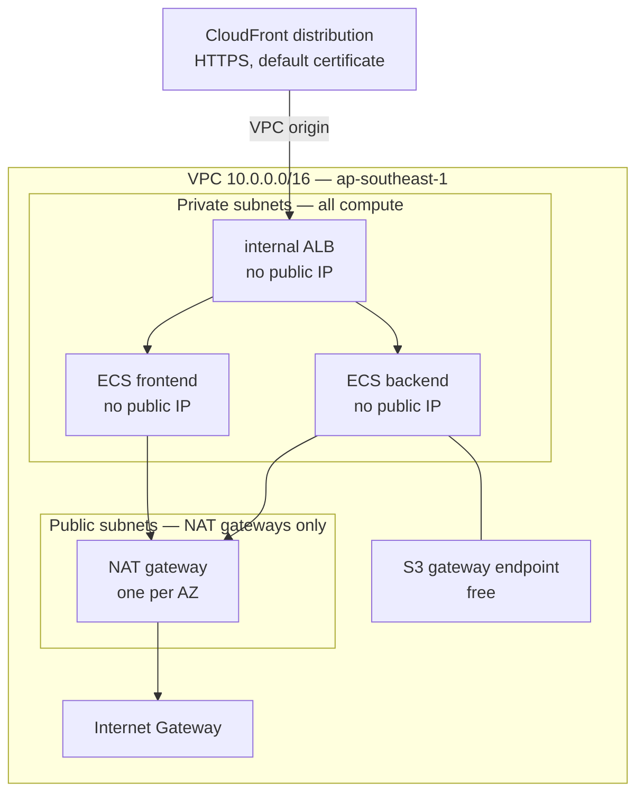

# 09 — Networking

> **Status:** Approved — 2026-08-22
> **Satisfies:** REQ-050–056
> **Depends on:** [08 — Infrastructure](08-infrastructure.md), [ADR-005](adr/ADR-005-runtime-and-persistence.md), [ADR-006](adr/ADR-006-requirement-alignment-over-cost.md)
>
> ⚠ **Amended by [ADR-006](adr/ADR-006-requirement-alignment-over-cost.md):** cost is no longer a
> design driver. Interface VPC endpoints, WAF, VPC Flow Logs, and per-AZ NAT are now
> **deployed**. Sections below still carry the cost figures — they are reporting, not
> justification for omitting anything.

## 1. Purpose

The requirements ask for the network design to be **explained**, not merely built. The
section numbering maps one-to-one onto the six questions asked:

| Requirement area | Section | Requirement |
|---|---|---|
| Network topology | §1 | REQ-050 |
| Service communication paths | §2 | REQ-051 |
| Security boundaries | §3 | REQ-052 |
| Traffic flow | §4 | REQ-053 |
| Ingress and egress controls | §5 | REQ-054 |
| Design tradeoffs | §6 | REQ-055 |

**The governing constraint (REQ-056)** is that this application handles *sensitive
customer information* and is *intended for internal use*. Its users are employees, never
customers. Every decision below is measured against that sentence — and where a cost
optimisation conflicted with it, the cost optimisation lost. §6.2 records one that was
proposed, accepted, and then reversed.

---

## §1 Network topology  *(REQ-050)*

Single VPC, `10.0.0.0/16`, in `ap-southeast-1`, across two Availability Zones. The
account's default VPC (`172.31.0.0/16`) is untouched and the ranges do not overlap.



| Subnet | CIDR | AZ | Contains | Public IP |
|---|---|---|---|---|
| `public-a` | `10.0.0.0/24` | 1a | NAT only | NAT EIP |
| `public-b` | `10.0.1.0/24` | 1b | NAT only | NAT EIP |
| `private-a` | `10.0.10.0/24` | 1a | ALB ENI, ECS tasks | **none** |
| `private-b` | `10.0.11.0/24` | 1b | ALB ENI, ECS tasks | **none** |

Two properties define this topology:

- **Nothing in the VPC has a public IP except the NAT.** Not the load balancer, not the
  frontend, not the backend. The public subnets exist solely to give NAT a route to the
  internet gateway.
- **The load balancer is `internal`.** It holds private IPs only and is reachable
  exclusively as a CloudFront VPC origin. There is no internet-facing listener anywhere
  in this design.

This is stronger than the conventional public-ALB pattern. There, the load balancer is
internet-addressable and its security group is the only thing between the internet and
the listener. Here the listener is not addressable from the internet at all.

---

## §2 Service communication paths  *(REQ-051)*

| # | From | To | Protocol | Authorised by |
|---|---|---|---|---|
| 1 | Browser | CloudFront | HTTPS 443 | Public; TLS via CloudFront's default certificate |
| 2 | CloudFront | internal ALB | HTTP 80, **VPC origin** | VPC-origin association; ALB SG admits the VPC-origin ENI SG only |
| 3 | ALB | `frontend` task | HTTP 8080 | Frontend SG admits **the ALB SG** |
| 4 | ALB | `backend` task | HTTP 8000 | Backend SG admits **the ALB SG** |
| 5 | `backend` | NAT → Gemini API | HTTPS 443 | Backend SG egress; private route table → NAT |
| 6 | `backend` | NAT → LangSmith | HTTPS 443 | Same; only when `LANGSMITH_TRACING=true` |
| 7 | `backend` | **Secrets Manager interface endpoint** | HTTPS 443 | Execution role, scoped to named secret ARNs. **Never leaves the VPC** |
| 8 | `backend` | NAT → Cognito JWKS | HTTPS 443 | Public keys; response signature-verified |
| 9 | Both tasks | **ECR API/DKR + CloudWatch Logs interface endpoints** | HTTPS 443 | Execution role. **Never leaves the VPC** |
| 10 | Both tasks | **S3 gateway endpoint** → ECR layers | HTTPS 443 | Endpoint route; no internet transit |
| 11 | Browser | Cognito Hosted UI | HTTPS 443 | Direct; does not traverse the VPC |

Three things worth naming:

- **There is no `frontend → backend` path.** The SPA runs in the browser; its API calls
  go to CloudFront, not to the backend task. The frontend container serves static files
  and nothing else. A compromised frontend container gains no network reach toward the
  data — that class of internal-authentication problem is removed by construction rather
  than mitigated by control.
- **Security groups reference security groups, never CIDR blocks.** Path 4 permits *the
  load balancer*, not *anything holding an address in `10.0.10.0/24`*. This survives
  subnet resizing and cannot be widened by a mistyped CIDR.
- **ECR layer pulls never touch the internet** (path 10), via the free S3 gateway
  endpoint. Image layers are the bulk of NAT data volume, making this both a security
  and a cost decision.

---

## §3 Security boundaries  *(REQ-052)*

Four concentric boundaries, each enforced by a different mechanism, so no single
misconfiguration collapses more than one.

```
┌─ B1  Edge ───────────────────────────────────────────────────┐
│  CloudFront is the ONLY internet-reachable surface.          │
│  HTTPS only. The origin has no public address.               │
│  ┌─ B2  Identity ───────────────────────────────────────┐    │
│  │  Cognito JWT required on every /api/* call,          │    │
│  │  verified in-app against the pool's JWKS.            │    │
│  │  ┌─ B3  Network ──────────────────────────────────┐  │    │
│  │  │  All compute in private subnets.               │  │    │
│  │  │  No public IPs. SG-to-SG rules, default deny.  │  │    │
│  │  │  ┌─ B4  Authorisation + data ─────────────┐    │  │    │
│  │  │  │  Cognito group claims gate mutations.  │    │  │    │
│  │  │  │  IAM task roles scoped to named ARNs.  │    │  │    │
│  │  │  │  Every mutation writes an audit row.   │    │  │    │
│  │  │  └────────────────────────────────────────┘    │  │    │
│  │  └────────────────────────────────────────────────┘  │    │
│  └──────────────────────────────────────────────────────┘    │
└──────────────────────────────────────────────────────────────┘
```

| Boundary | Enforced by | Crossing it requires |
|---|---|---|
| **B1 — Edge** | CloudFront; internal ALB; VPC origin | Nothing — CloudFront is public by design. But it is the *only* door |
| **B2 — Identity** | Backend JWT validation | A valid, unexpired Cognito access token for this pool and client |
| **B3 — Network** | Private subnets, absent public IPs, SG-to-SG rules | Being CloudFront's VPC origin, or already being a task in the VPC |
| **B4 — Authorisation and data** | Group claims, IAM task roles, audit log | The right group for the action; the right role for the resource |

**The trust boundary is B2, not B1.** CloudFront is deliberately public so the system is
usable, and the security argument does not rest on obscurity: an unauthenticated request
to `/api/v1/customers/CUST-004217` returns `401` regardless of where it came from.
Reaching CloudFront grants nothing.

**B3 is defence in depth, and that is exactly its value.** If a security-group rule were
mistakenly widened, private subnets still have no route from the internet — a second,
independent control must also fail before exposure occurs. §6.2 records the proposal
that would have removed this property, and why it was rejected.

---

## §4 Traffic flow  *(REQ-053)*

### 4.1 First load and sign-in

```
Browser ─HTTPS─► CloudFront ─VPC origin─► ALB ─HTTP─► frontend task   (SPA delivered)
Browser ─HTTPS─► Cognito Hosted UI                    (never enters the VPC)
Browser ◄─redirect─ Cognito                           (authorization code)
Browser ─HTTPS─► Cognito /oauth2/token                (code + PKCE verifier → tokens)
```

The token exchange never traverses the VPC — Cognito is a public endpoint the browser
talks to directly, so no credential passes through our compute.

### 4.2 An authenticated agent request

```
Browser ─HTTPS + Bearer─► CloudFront
   └─ VPC origin ─► internal ALB
        └─ /api/* ─► backend task (private-a or -b)
             ├─► Cognito JWKS   via NAT   (cached ~1 h; usually no call)
             ├─► local SQLite               (in-container — no network hop)
             ├─► Gemini API     via NAT   (generation)
             ├─► LangSmith      via NAT   (tracing, when enabled)
             └─► CloudWatch     via NAT   (structured logs)
   ◄── SSE stream back through the ALB and CloudFront
```

The database is a **local file**, not a network destination. Removing EFS removed an
entire network path and with it an NFS mount, a mount-target security group, and a
shared-filesystem attack surface
([ADR-005](adr/ADR-005-runtime-and-persistence.md) §3).

### 4.3 Bytes on the wire

| Segment | Encrypted | By what |
|---|---|---|
| Browser → CloudFront | **TLS 1.2+** | CloudFront default certificate |
| CloudFront → ALB | Plaintext HTTP, but **over the AWS network via VPC origin** — never the public internet | — |
| ALB → task | Plaintext HTTP | One hop inside a private subnet, SG-restricted |
| Task → Gemini / LangSmith | TLS 1.3 | Provider endpoints |
| Task → AWS APIs | TLS | AWS SDK default |
| Database | n/a — local file | Container filesystem |

**Both plaintext hops are inside AWS, and neither traverses the internet.**

Making CloudFront→ALB HTTPS would need a certificate on the ALB signed by a public CA,
which needs a domain we do not have. The three available options were: (a) an
internet-facing ALB over HTTP restricted by the CloudFront prefix list — which puts
plaintext on the *public internet*; (b) buy a domain — out of scope; (c) VPC origin over
HTTP — plaintext confined to the AWS network. (c) is strictly the best of the three.

---

## §5 Ingress and egress controls  *(REQ-054)*

### 5.1 Ingress

| Layer | Rule |
|---|---|
| CloudFront | HTTPS only; `viewer_protocol_policy = redirect-to-https`; TLS 1.2 minimum |
| ALB security group | Inbound `80` **from the CloudFront VPC-origin ENI security group only** |
| Frontend SG | Inbound `8080` **from the ALB SG only** |
| Backend SG | Inbound `8000` **from the ALB SG only** |
| Network ACLs | Default allow-all — segmentation is done with security groups (§6.4) |
| Application | Cognito JWT required on every `/api/*` route |

**No security group in this design admits `0.0.0.0/0` on any port.** The internet-facing
tier is CloudFront, which is not in the VPC.

### 5.2 Egress

Choosing Gemini over Bedrock ([ADR-001](adr/ADR-001-llm-provider.md)) means the backend
must reach the public internet; enabling LangSmith adds a second destination. That is
the largest concession in this design, stated plainly rather than buried.

| Rule | Value |
|---|---|
| Backend SG egress | `443/tcp` to `0.0.0.0/0` |
| Frontend SG egress | `443/tcp` to `0.0.0.0/0` (image pull, logs) |
| Route | Private subnets → NAT (per AZ) → IGW, for internet destinations only |
| AWS service traffic | Interface endpoints — never routed to NAT |
| S3 traffic | Gateway endpoint — never leaves the AWS network |
| Any port other than 443 | Denied outbound |

**Why not an IP allowlist?** Google's and LangSmith's endpoints resolve across large,
changing ranges. A static prefix list would break silently at the worst possible moment
— a control that looks strict and fails open is worse than an honest coarse one.

Options for genuinely restricting egress, at verified rates ([02](02-research.md) §6):

| Option | Control | Cost | Verdict |
|---|---|---|---|
| **NAT + port 443 only** *(chosen)* | Coarse; blocks every non-HTTPS exfiltration path | $0.059/hr per gateway, one per AZ | Baseline for the two genuinely public destinations |
| **S3 gateway endpoint** *(chosen)* | Removes ECR layer pulls from the internet path | **free** | No reason not to |
| **Interface endpoints — ECR API/DKR, Secrets, Logs** *(now chosen)* | Removes remaining AWS-service traffic from the internet path | **$0.013/hr each, per AZ** | Deployed — ADR-006 §3 |
| Network Firewall, FQDN allowlist | Strong — only the named hosts | ~$0.395/hr + data | ~7× NAT. Correct for real customer data |
| Bedrock via interface endpoint | **Eliminates internet egress entirely** | endpoint only | Blocked — model access `NOT_AUTHORIZED` ([02](02-research.md) §2.1) |

**Interface endpoints are deployed** ([ADR-006](adr/ADR-006-requirement-alignment-over-cost.md) §3).
They were previously omitted on the argument that NAT is required regardless for Gemini
and LangSmith, so removing AWS-service traffic from it bought a partial benefit at
comparable cost. That argument only held while cost was a design driver, and it had one
clear casualty: **the Gemini and LangSmith API keys were fetched from Secrets Manager
over NAT, across the public internet, on every task start.** That is now an entirely
in-VPC call, and it was the weakest point in the secrets story
([10](10-security.md) §4) purely to save $0.013/hour.

If Bedrock ever replaces Gemini this goes further still — NAT deleted, zero internet
egress — which remains the strongest argument for the Bedrock path.

### 5.3 What leaves the VPC

| Destination | Contains | Sensitivity |
|---|---|---|
| Gemini API | Prompts, evidence, transcripts | **Highest** — synthetic data only, by construction |
| LangSmith *(opt-in)* | Prompts, tool results, graph state | **Highest** — same basis; off by default |
| Secrets Manager | Secret ARNs out, values back | Credential |
| Cognito | JWKS fetch (public keys) | None |
| ECR API / CloudWatch Logs | Manifests; structured logs — IDs and decisions, **never PII or content** | Low |

The first two rows are the ones that matter. Interaction transcripts are sent to
third-party APIs over the internet. This is acceptable **only** because every record is
synthetic ([12](12-seed-data.md)). A production deployment on real customer data would
need Bedrock in-region behind an interface endpoint, or Vertex AI in `asia-southeast1`
behind Private Service Connect, plus a data-processing agreement — and LangSmith would
have to be self-hosted or disabled. Recorded as a limitation, not a solved problem.

---

## §6 Design tradeoffs  *(REQ-055)*

### 6.1 CloudFront + private ALB rather than an internet-facing ALB

| | CloudFront → private ALB *(chosen)* | Internet-facing ALB |
|---|---|---|
| Viewer TLS | Free default certificate | Needs a domain + ACM, or plaintext |
| Origin reachable from internet | **No** | Yes, SG-restricted |
| Plaintext on the public internet | None | Yes, unless a certificate is bought |
| Cost | ALB + CloudFront (free tier covers this volume) | ALB only |
| Complexity | A distribution to provision; minutes to propagate | Simpler |

Chosen because it resolves the TLS gap without buying a domain *and* removes the origin
from the internet. This was previously logged as a blocking limitation; the VPC origin
closed it.

### 6.2 Private subnets rather than public subnets with public IPs — a reversed decision

An earlier revision put ECS tasks in public subnets with `assign_public_ip = true` to
avoid the NAT charge. **It was accepted and then reversed before implementation**
([ADR-005](adr/ADR-005-runtime-and-persistence.md) §6). It is recorded here rather than
quietly dropped, because the reasoning is the substance of REQ-056.

The argument for it was that a public IP is not an exposure while the task security
group admits only the ALB. That is true — *while the security group is correct*. It is a
**single-control design**: one over-permissive rule and the backend is directly
addressable from the internet with nothing else in the way. In a private subnet the same
mistake exposes nothing, because no route exists.

For a system whose security argument is itself a deliverable, trading away a
defence-in-depth layer for **$39/month** is the wrong trade. The cost is reconciled
instead by choosing the NAT *implementation* per environment:

| | `dev` | `prod` |
|---|---|---|
| NAT | NAT gateway per AZ | NAT gateway per AZ |
| Accepted downside | Cost — no longer a design driver ([ADR-006](adr/ADR-006-requirement-alignment-over-cost.md)) | Cost |
| Idle floor | $0 — the stack is destroyed | not applied — configuration only |

The NAT *instance* variant that briefly replaced this was itself reversed by
[ADR-006](adr/ADR-006-requirement-alignment-over-cost.md) §3 — it saved money and added
a host to patch and a single point of failure. Both environments now use managed NAT
gateways, one per AZ.

### 6.3 ~~One NAT rather than one per AZ~~ — **REVERSED, then made a variable**

> Amended by [ADR-006](adr/ADR-006-requirement-alignment-over-cost.md) §3.

A single NAT gateway saved $0.059/hr at the cost of an AZ-a dependency for *all* egress:
if AZ-a failed, reads still served but every model call stopped. A `t4g.nano` NAT
instance in `dev` saved more and added a host to patch and a single point of failure.

Both were cost decisions, and cost is no longer the binding constraint. **A NAT gateway
per AZ is now deployed in both environments** — the standard pattern, no host to
maintain, no single-AZ egress dependency. `public-b` is no longer empty.

**Amended 2026-08-23.** The reversal above stands as the *default* — `network.tf` creates
one NAT per AZ unless told otherwise — but it is now `var.single_nat_gateway` rather than
a fixed decision, and `dev` sets it to `true`.

What changed is not the reasoning, it is which environment the reasoning applies to. The
argument against a single NAT is that one AZ's egress comes to depend on another AZ being
healthy. That is a real availability defect in an environment that is meant to stay up.
`dev` is ephemeral, single-purpose, and destroyed when idle (ADR-004) — nothing there
depends on surviving an AZ failure, and the second NAT is 23% of the idle bill (docs/16
§4). `prod.tfvars` keeps one per AZ.

The same amendment applies to `var.enable_interface_endpoints`, which is off in `dev`.
With it off, traffic to ECR, Secrets Manager, and CloudWatch Logs leaves the VPC through
NAT instead of staying on an interface endpoint. It is still TLS, still on the AWS
backbone, and still constrained by the task security group — but §5.2's claim that
AWS-service traffic never leaves the VPC is **true of `prod` and not of `dev`**, and that
distinction is worth stating plainly rather than leaving the reader to infer it from a
tfvars file.

The **S3 gateway endpoint is unconditional** in both. It is free, and it carries ECR layer
pulls, which are the great majority of the bytes either configuration moves.

### 6.6 CloudFront or an internet-facing ALB — `var.edge`

*(Added 2026-08-23.)* Everything above describes `edge = "cloudfront"`, which is the
design this document argues for and the default. `dev` currently runs `edge = "alb"`, and
this section is the honest accounting of what that changes.

**Why.** AWS refuses to create a CloudFront distribution on an unverified account, and
that is a Support case with no API and no workaround
([18](18-aws-access-and-manual-steps.md) §3.4). The brief leaves service selection open,
so an internet-facing ALB is a legitimate choice rather than a compromise — but it is not
an equivalent one.

**What is unchanged.** Almost everything. Same VPC, same two AZs, same private subnets,
same security-group-to-security-group rules, same task definitions, same IAM, same
Cognito, same audit trail. The compute does not move: tasks stay in private subnets with
no public IP under both edges.

**What changes, precisely:**

| | `cloudfront` | `alb` |
|---|---|---|
| Listener address | **None from the internet.** The ALB is `internal` and holds private IPs only | Public DNS name, reachable from anywhere |
| B1 (edge) | CloudFront is the only door; the origin has no public address | **The security group is the only thing between the internet and the listener** |
| Viewer TLS | CloudFront's own certificate, TLS 1.2 minimum | HTTPS only if `acm_certificate_arn` is set, which needs a domain. Otherwise **HTTP** |
| WAF | Global scope, at the edge | Regional scope, attached to the ALB — same rules |
| Caching | `/api/*` explicitly uncached; hashed assets cached hard | No cache layer at all, so the risk of serving one agent's response to another does not arise |
| Subnets holding the ALB | Private | Public (an internet-facing LB requires a route to the IGW) |

**The honest summary.** [§3](#3-security-boundaries-req-052) says the trust boundary is
B2, not B1 — an unauthenticated request to `/api/v1/customers/…` returns `401` wherever it
comes from, and reaching the edge grants nothing. That argument holds under both edges,
and it is why this substitution is defensible at all.

What is genuinely lost is **defence in depth at B3**. Under `cloudfront`, a security group
mistakenly widened to `0.0.0.0/0` still exposes nothing, because a private subnet has no
route from the internet either — two independent controls must fail. Under `alb`, that
security group *is* the control, and widening it is sufficient to expose the listener.
That is a real reduction, and it is the reason the CloudFront design is the default rather
than the other way round.

**Without a certificate there is a second loss:** the viewer hop is unencrypted. The data
is synthetic ([00](00-constitution.md) §7), so this is a demonstration risk rather than a
disclosure one — but a Cognito access token also crosses that hop, and an unencrypted
token is an unencrypted credential. Set `acm_certificate_arn` and it goes away; a domain
in a cheap TLD plus DNS validation is about fifteen minutes.

**Reversing it is one word** in `envs/dev.tfvars`. The ALB is replaced, the VPC origin and
the regional WAF are swapped for their CloudFront equivalents, and nothing else moves.

### 6.4 Security groups rather than NACLs

NACLs are stateless, subnet-wide, and evaluated in rule-number order — easy to get
subtly wrong and hard to read later. Security groups are stateful and reference each
other by identity. Defence in depth would use both; at this scale the second layer adds
more misconfiguration risk than protection.

Note this is a *different judgement* from §6.2, and the difference is the point: there,
the second layer (subnet routing) is free and automatic; here, it is hand-maintained and
error-prone. Defence in depth is worth paying for when the layer is reliable, not when
it is another thing to get wrong.

### 6.5 What is deliberately absent

After [ADR-006](adr/ADR-006-requirement-alignment-over-cost.md), only two controls
remain absent, and **neither is omitted for cost**:

| Omitted | Would provide | Why not here |
|---|---|---|
| **Network Firewall** | FQDN egress allowlist — traffic restricted to named hosts | ~$0.395/hr, and it is the one control a real deployment would still need. Omitted because every record is synthetic ([12](12-seed-data.md)). Reconsider the moment `DATABASE_URL` points at real data |
| **GuardDuty** | Threat detection | Requires weeks of traffic to baseline. An environment applied and destroyed per session never provides that — a cost-independent reason |

Everything else is deployed: per-AZ NAT gateways, interface endpoints for ECR/Secrets/
Logs, the S3 gateway endpoint, WAF on CloudFront with managed rules and rate limiting,
and VPC Flow Logs to CloudWatch. Together with identity enforcement, private compute
with no public IPs, an origin unreachable from the internet, least-privilege IAM,
encrypted viewer transit, and audited mutations, the posture is now standard practice
rather than a cost-constrained subset of it.

---

## 7. Failure modes

| Failure | Detection | Behaviour |
|---|---|---|
| AZ-a loss | NAT unreachable | ALB and tasks survive in 1b; generation fails, reads still answer. §6.3 |
| NAT instance fails (`dev`) | Health check | Egress down until replaced. Accepted for `dev` |
| CloudFront → origin failure | 502 at the edge | Custom error page; ALB target health identifies the cause |
| VPC origin misconfigured | CloudFront cannot reach the ALB | Fails closed — there is no public path to fall back to |
| SG too narrow | Health checks fail | Targets unhealthy; ECS surfaces it before users are affected |
| CloudFront caches an authenticated response | — | Prevented: the `/api/*` behaviour disables caching and forwards `Authorization` |
| ALB idle timeout cuts SSE | Stream ends without `done` | Timeout raised to 120 s; 15 s heartbeats ([06](06-backend-api.md) §3.4) |
| Egress attempted on a non-443 port | Dropped by SG | Silent on the wire, visible in the task log — by design |
| Gemini DNS failure | Connection error | Classified `transient`, retried with backoff ([05](05-langgraph-orchestration.md) §3.11) |

## 8. Open questions

1. **CloudFront cache behaviours.** `/api/*` must be uncached with `Authorization`
   forwarded; static assets should cache aggressively. This must be pinned explicitly in
   Terraform — a mistake here could serve one agent's response to another, which makes
   it the highest-risk configuration item in this document.
2. **Should `dev` use a NAT instance at all?** It saves $39/month but adds a host to
   patch. If `dev` is genuinely destroyed between sessions, a NAT gateway costs ~$1.42
   per running day and removes the host entirely. Leaning toward the gateway for both,
   with the instance documented as the option.
3. **WAF on CloudFront for `prod`.** ~$0.0075/hr for managed rules and rate limiting on
   the only internet-facing surface — cheap relative to what it protects. Omitted only
   because `prod` may never run continuously.
4. **VPC Flow Logs to CloudWatch, 1-day retention.** Would cost very little and make
   this document demonstrable rather than merely described.
