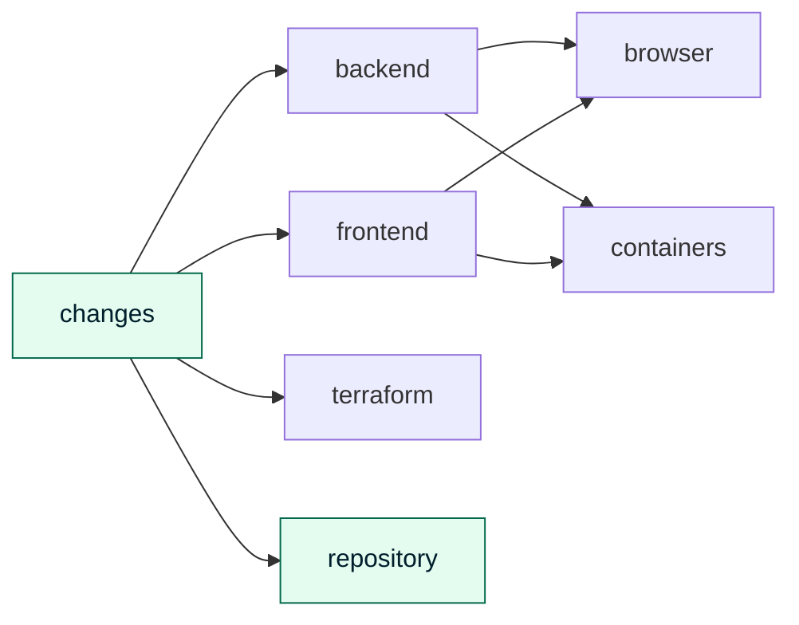
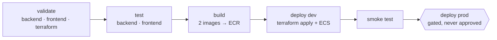

# 11 — CI/CD

> **Status:** Approved — 2026-08-22
> **Satisfies:** REQ-044, REQ-070–073, REQ-006
> **Depends on:** [08 — Infrastructure](08-infrastructure.md), [10 — Security](10-security.md), [ADR-006](adr/ADR-006-requirement-alignment-over-cost.md)

## 1. Purpose

The pipeline that validates, tests, builds, and deploys both services. The requirements
ask for all four stages to be demonstrated; §3.2–§3.5 map onto them directly.

## 2. Scope

**In scope:** platform choice, AWS authentication, workflow structure, the four stages,
branch-to-environment mapping, rollback, required checks.

**Out of scope:** infrastructure definitions ([08](08-infrastructure.md)), IAM policy
rationale ([10](10-security.md)), test design ([05](05-langgraph-orchestration.md) §3.12).

---

## 3. Design

### 3.1 Platform and authentication

**GitHub Actions**, because the repository lives there and it needs no additional
infrastructure to run — CodePipeline would mean provisioning and paying for the CI
system itself.

**No static AWS credentials anywhere.** Authentication is GitHub OIDC role assumption:

```yaml
permissions:
  id-token: write        # mint the OIDC token
  contents: read
steps:
  - uses: aws-actions/configure-aws-credentials@v4
    with:
      role-to-assume: ${{ vars.AWS_DEPLOY_ROLE_ARN }}
      aws-region: ap-southeast-1
```

The trust policy scopes assumption to this repository **and** to specific refs, so a
fork or an unrelated branch cannot assume it:

```json
"Condition": {
  "StringEquals":     { "token.actions.githubusercontent.com:aud": "sts.amazonaws.com" },
  "StringLike":       { "token.actions.githubusercontent.com:sub": "repo:ORG/ccoa-agent:ref:refs/heads/main" }
}
```

A long-lived access key in repository secrets would be a permanent credential with no
natural expiry and no per-ref scoping. OIDC tokens are minted per run and expire.

### 3.2 Workflow structure

Two workflows, because they answer different questions at different moments:

| Workflow | Trigger | Asks | Credentials |
|---|---|---|---|
| `ci.yml` | PR to `main` or `develop`; push to any branch but `main` | *Is this change sound?* | **None** — safe on a fork |
| `deploy.yml` | Push to `main`, manual dispatch | *Should this become the running system?* | Assumes an AWS role by OIDC |

Merging them would mean one of two bad things: granting deploy credentials to
pull-request runs — which is how a fork gets to assume your role — or carrying a large
`if:` on every step of a single workflow until neither path is legible.

#### Nothing runs that the change cannot affect

*(Added 2026-08-23.)* Both workflows begin with a `changes` job that diffs against the
merge base, and every other job keys off it.



| Change | Runs |
|---|---|
| `backend/**` | backend, browser, containers, repository |
| `frontend/**` | frontend, browser, containers, repository |
| `terraform/**` | terraform, repository |
| `docs/**` only | **repository only** |

The repository checks have no filter, deliberately: an account id or a secret is most
often leaked in a *document*, so a docs-only change is exactly when they matter.

The workflow file counts as a change to everything it runs. Editing a job must exercise
that job, or the edit stays untested until something unrelated happens to touch the same
area.

#### Only the changed service is rebuilt and redeployed

`deploy.yml` tags each image with **the last commit that touched that service**, not the
head commit:

```bash
backend_tag="$(git log -1 --format=%H -- backend)"
frontend_tag="$(git log -1 --format=%H -- frontend)"
```

A frontend-only change therefore leaves the backend's tag exactly as it was. Terraform is
declarative, so an unchanged tag produces no diff and ECS does not replace a task that has
not changed. The build is skipped too — the tag is already in ECR, and the repositories
are `IMMUTABLE`, so pushing it again would fail rather than overwrite.

That matters more than build minutes. Replacing the backend is **a brief outage by
design**: two backend tasks would be two divergent databases, so the deployment strategy
stops the old task before starting the new one ([04](04-data-model.md) §3.5). Not
redeploying a service that has not changed avoids an outage that buys nothing.

Jobs run per service where they can. `backend` and `frontend` validate, test, and build
**in parallel and independently** — a frontend lint failure does not block a backend
deploy, which is what REQ-006 ("deployed independently") means in pipeline terms.



### 3.3 Validate  *(REQ-070)*

| Target | Checks |
|---|---|
| Backend | `ruff check`, `ruff format --check`, `mypy --strict app` |
| Frontend | `eslint`, `tsc --noEmit`, `prettier --check` |
| Terraform | `fmt -check -recursive`, `validate`, `tflint`, `tfsec` |
| Repository | **`gitleaks`** — secret scanning on the full history |
| Skills | Frontmatter schema, tool-name cross-check, token budget ([17](17-agent-skills.md) §3.10) |
| Prompts | **`check_no_inline_prompts.py`** — fails on string literals >200 chars under `app/graph/`, `app/agents/` ([17](17-agent-skills.md) §3.9) |

The last two are unusual and deliberate. A skill referencing a tool that does not exist,
or a prompt smuggled back into Python, are both defects this design specifically forbids
— so they fail the build rather than relying on review.

### 3.3a Repository checks

Three checks that are not tests, and each exists because the thing it guards is one a
convention would not hold:

| Check | Fails on | Why a check |
|---|---|---|
| `backend/tools/check_no_inline_prompts.py` | A string literal over 200 characters under `app/graph/` or `app/agents/` | Prompts drift back into Python one "just this once" at a time ([17](17-agent-skills.md) §3.9) |
| `tools/check_no_account_identifiers.py` | An account number, resource id, access key, sign-in URL, or local path anywhere in the repository | This repository is public, and git history does not forget ([18](18-aws-access-and-manual-steps.md) §6) |
| `alembic check` | A model change with no migration | Otherwise it surfaces as a missing column at runtime ([04](04-data-model.md) §3.7) |

The account-identifier check runs on **every** file type, not just docs — the likeliest
leak is a pasted `terraform plan` diff or a console error in a comment, not a considered
sentence in a specification.

### 3.4 Test  *(REQ-071)*

| Suite | Scope | Network |
|---|---|---|
| `pytest` unit | Reducers, routing predicates, tool validation, repositories | none |
| `pytest` graph | Node sequences per intent, with `MemorySaver` and a stubbed model | none |
| `pytest` HITL | `interrupt` → resume, approve **and** reject, audit rows written | none |
| `pytest` grounding | Every ID in an answer appears in `evidence` ([05](05-langgraph-orchestration.md) §3.12) | none |
| **Alembic round-trip** | `upgrade head` → `downgrade base` → `upgrade head` on a scratch DB | none |
| `vitest` | Components, hooks, the SSE parser | none |
| Coverage | Fails under 80% on `app/` | — |

**No unit test touches the network.** The model is stubbed and the checkpointer is
in-memory, which is exactly why `build_graph` takes both as parameters
([00](00-constitution.md) §7). Tests needing a live Gemini key are marked
`@pytest.mark.live` and excluded by default — CI has no LLM credentials, and a pipeline
that fails because a third-party API is slow is a pipeline people learn to ignore.

The Alembic round-trip catches a broken `downgrade()` at build time rather than during
an incident ([04](04-data-model.md) §3.7).

### 3.4a Agent evaluations — deliberately not in this pipeline

Agent quality is measured by the eval suite ([19](19-agent-evaluation.md)), and it does
**not** run on every commit. It needs a real model key, takes three and a half minutes,
and its judged half is statistical — a flaky gate is a gate people learn to bypass.

| Runs here | Runs on demand |
|---|---|
| The dataset's own validity, which needs no key | The 18 eval checks against the live model |

The intended cadence is before a release and after any change to a `SKILL.md` — prompt
changes being exactly what evals exist to catch. Promoting the deterministic half to a
release gate is [19](19-agent-evaluation.md) §7 question 2; it would mean giving the
pipeline a model key it does not otherwise need.

### 3.5 Build  *(REQ-072)*

| Step | Detail |
|---|---|
| Builder | `docker buildx`, **`linux/arm64`** to match Fargate ([02](02-research.md) §6) |
| Tags | `${GITHUB_SHA}` — immutable. **Never `:latest`** |
| Cache | GitHub Actions cache backend |
| Scan | **Trivy**, fails the build on `HIGH` or `CRITICAL` with a fix available |
| SBOM | CycloneDX, attached as a build artifact |
| Litestream | Pinned by version **and SHA-256** in the backend Dockerfile ([ADR-007](adr/ADR-007-durable-sqlite-via-s3.md)) |
| Push | Two ECR repositories, only on `deploy.yml` |

Trivy fails only on findings **with a fix available**, because a build that cannot pass
for reasons nobody can act on gets bypassed, and a bypassed gate is worse than none.

The seeded database is built into the backend image ([12](12-seed-data.md)), so the
build is also where the corpus is generated — deterministically, from a fixed seed, so
the same commit produces the same data.

### 3.6 Deploy  *(REQ-073)*

```
terraform apply -var-file=envs/dev.tfvars -var image_tag=$GITHUB_SHA
  → aws ecs wait services-stable   (both services)
  → smoke test against the CloudFront domain
  → on failure: roll back to the previous task-definition revision
```

| Step | Detail |
|---|---|
| Plan visibility | `terraform plan` posted as a PR comment on `ci.yml` |
| Apply | `deploy.yml` only, after tests pass |
| Wait | `aws ecs wait services-stable` — the job fails if tasks never stabilise |
| Smoke test | `GET /healthz`, `GET /readyz`, and an **unauthenticated** `GET /api/v1/threads` asserting `401` |
| Rollback | Re-point the service at the previous task-definition revision and wait again |
| Concurrency | `concurrency: deploy-dev` — no overlapping deploys |

The smoke test asserting `401` matters more than it looks: it is the one automated check
that authentication is actually enforced end to end, through CloudFront and the ALB. A
misconfigured cache behaviour or a dropped `Authorization` header would show up here
([08](08-infrastructure.md) §3.5).

### 3.7 Branch and environment mapping

**Amended 2026-08-23.** `develop` deploys, `main` does not, which is the reverse of the
convention and worth explaining rather than discovering.

| Branch | Holds | Deploys |
|---|---|---|
| `main` | The architecture the design argues for — CloudFront edge, internal ALB | **No.** AWS will not create the distribution until the account is verified ([09](09-networking.md) §6.6) |
| `develop` | The same Terraform with `edge = "alb"` | **Yes**, to `dev` |

The rule underneath is the one that matters: **one branch owns an environment.** Both
branches share a state file, so triggering the deploy from both means whichever pushed
last rewrites the environment in its own image. That is not theoretical — a deploy from
`main` reached the build step before being cancelled, and its next action would have been
to replace the working load balancer and then fail at CloudFront, leaving nothing serving.

When the account clears, `main` becomes deployable and the trigger moves back with it.


| Branch | Environment | Behaviour |
|---|---|---|
| feature branches | none | `ci.yml` only — validate, test, build, plan |
| `main` | **`dev`** | Auto-deploy on merge |
| `main` | `prod` | Job exists, gated on a protected GitHub Environment — **never approved** |

**`prod` is a real job, not a comment.** It is gated on a protected Environment with
required reviewers, which is the same mechanism a genuine promotion gate uses. Approval
is never granted, so `prod` is never applied
([ADR-006](adr/ADR-006-requirement-alignment-over-cost.md) §2). This demonstrates the
promotion path without provisioning a second stack — and the honest limitation is that
**`prod` configuration has never been executed**, so it is unproven.

### 3.8 Required checks and repository settings

| Setting | Value |
|---|---|
| Branch protection on `main` | Required: `validate`, `test`, `build`. No direct pushes |
| Environments | `dev` (no reviewers), `prod` (required reviewers) |
| Variables | `AWS_DEPLOY_ROLE_ARN`, `AWS_REGION` — non-sensitive |
| Secrets | **None.** OIDC removes the need |
| Dependabot | Weekly, grouped, for `pip`, `npm`, `terraform`, `github-actions` |

That the repository holds **no secrets at all** is the clearest evidence the credential
model works ([10](10-security.md) §4). Application secrets live in Secrets Manager and
are injected at task start; AWS access is OIDC-minted per run.

---

## 4. Decisions and tradeoffs

| Decision | Alternative | Rationale |
|---|---|---|
| GitHub Actions | CodePipeline / CodeBuild | No CI infrastructure to provision or pay for; the code already lives on GitHub |
| OIDC role assumption | Static access key in secrets | No permanent credential; scoped per repo and ref; expires per run |
| Per-service parallel jobs | One monolithic pipeline | Makes independent deployability (REQ-006) real rather than asserted |
| Trivy fails only on fixable findings | Fail on any HIGH | An unactionable gate gets bypassed |
| Live-LLM tests excluded by default | Run everything | Deterministic, offline, no CI credentials, no third-party flakiness |
| SHA image tags | `:latest` | Reproducible deploys; unambiguous rollback |
| Gated-but-never-approved `prod` | Omit `prod` entirely | Demonstrates the promotion path honestly, at the cost of unproven config |
| Smoke test asserts `401` | Health checks only | The only automated proof that auth is enforced through the whole edge path |

## 5. Failure modes

| Failure | Detection | Behaviour |
|---|---|---|
| Lint or type check fails | `validate` job | Merge blocked |
| Test fails | `test` job | Merge blocked; no image built |
| Trivy finds a fixable HIGH | `build` job | Build fails; bump the dependency |
| Prompt literal added to graph code | `check_no_inline_prompts.py` | Build fails ([17](17-agent-skills.md) §3.9) |
| Skill references a nonexistent tool | Skill validation | Build fails — before it could fail at container boot |
| Broken `downgrade()` | Alembic round-trip | Build fails |
| `terraform apply` fails | `deploy` job | Job fails; previous tasks keep serving |
| Tasks never stabilise | `ecs wait` timeout | Job fails; rollback step runs |
| Smoke test `401` assertion fails | `deploy` job | **Rollback** — auth is not enforced, which is not a warning-level defect |
| OIDC assumption denied | `configure-aws-credentials` | Job fails; check the trust policy's `sub` condition |
| Two deploys race | `concurrency` group | Second queues behind the first |

## 6. Open questions

1. **Should `ci.yml` run `terraform plan` against `dev`?** It gives real plan output on
   every PR, but needs the deploy role on pull-request runs — widening OIDC trust beyond
   `refs/heads/main`. A read-only plan role is the likely answer.
2. **Image cleanup.** ECR lifecycle policies keep the last N images, but a
   `terraform destroy` between sessions removes the repository entirely, so retention
   rarely bites. Worth confirming rather than assuming.
3. **Should the smoke test create a ticket end to end?** It would exercise the HITL path
   and Litestream replication in CI, but needs a Cognito test user and a live Gemini
   key — pushing CI into the class of tests deliberately excluded in §3.4.
4. **Deployment gap.** With `max_capacity = 1` and `minimumHealthyPercent = 0`, every
   backend deploy causes ~30–60 s of downtime. Unavoidable while the datastore is
   container-local ([08](08-infrastructure.md) §6).
