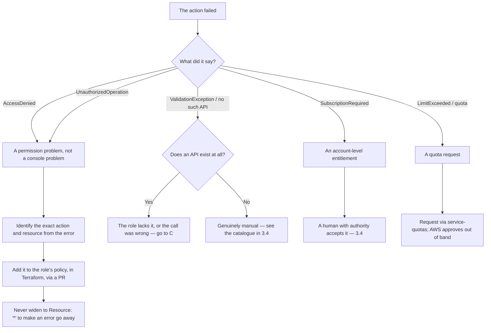

# 18 — AWS access and manual steps

> **Status:** Approved — 2026-08-22
> **Satisfies:** REQ-061, REQ-063, REQ-073
> **Depends on:** [10 — Security](10-security.md), [11 — CI/CD](11-cicd.md), [08 — Infrastructure](08-infrastructure.md)

## 1. Purpose

Two questions this repository needs a settled answer to:

1. **Who touches AWS, and as whom?** The short version: never the account owner.
2. **What do you do when an action cannot be performed from the CLI or from Terraform?**
   Some genuinely cannot be. Those are enumerated here with steps, so a blocked deploy
   has a runbook rather than an improvisation.

It also states the rule that keeps this repository publishable: **nothing here identifies
a specific AWS account**, and that rule is enforced by a check rather than by discipline
(§6).

## 2. Scope

**In scope:** the identity model, the bootstrap sequence, the catalogue of actions that
need a human, the escalation path when the CLI refuses, the record-keeping obligation
for manual changes, and the no-account-details rule.

**Out of scope:** what the infrastructure *is* ([08](08-infrastructure.md)), the
application's own authorisation model ([10](10-security.md) §3.1), pipeline stages
([11](11-cicd.md)).

---

## 3. Design

### 3.1 The rule: the owner account is not a working identity

The account owner — the root user — is not an operator, an engineer, or a deploy
credential. It is the recovery mechanism for the account, and using it for routine work
destroys the only thing it is for.

**Root is used for exactly these, and nothing else:**

| Task | Why root |
|---|---|
| Enable MFA on the root user itself | Nothing else can |
| Delete any root access keys | Nothing else can, and they should not exist |
| Change the account name, email, or contact details | Root-only by design |
| Enable IAM access to Billing and Cost Management | Root-only, one time |
| Close the account | Root-only |

Everything else — every deploy, every investigation, every quota request — is done by a
role. If a task appears to need root and is not on that list, the actual problem is a
missing permission on a role, and the fix is to grant it deliberately.

**Root has no access keys.** If any exist, deleting them is the first bootstrap step.
A root access key is a permanent, unscoped, unrevocable-by-policy credential; there is
no configuration in which one is the right answer.

### 3.2 The identities

Three, with different lifetimes and different blast radii. None of them is a person's
personal AWS login, and none of them is the owner.

| Identity | Kind | Used by | Credential | Lifetime |
|---|---|---|---|---|
| `ccoa-bootstrap` | Human role | One engineer, once | Assumed with MFA | Deleted after bootstrap |
| `ccoa-deploy` | **Service role** | GitHub Actions | GitHub OIDC — **no keys** | Permanent, no secret |
| `ccoa-operator` | Human role | Investigating a running system | Assumed with MFA | Permanent, read-mostly |

Three properties are the point of this arrangement:

- **The service account has no password and no access key.** `ccoa-deploy` is assumable
  only by a GitHub OIDC token from this repository, on a named ref
  ([11](11-cicd.md) §3.1). There is no credential to leak because there is no credential.
- **`ccoa-operator` cannot deploy.** Read, describe, and read logs. An engineer
  debugging production should not be able to change it by reflex; changes go through the
  pipeline, where they are reviewed and recorded.
- **`ccoa-bootstrap` is temporary.** It exists to create the other two and the Terraform
  state backend, and is deleted once they exist. A standing admin role is a standing
  risk, and this one has a natural end.

#### The permission boundary

`ccoa-deploy` is powerful — it creates VPCs, roles, and services. Without a boundary, a
role that can create roles can create a role more powerful than itself, and the
least-privilege story ends there.

So every role `ccoa-deploy` creates must carry a permission boundary, enforced by a
condition on its own policy:

```json
{
  "Effect": "Allow",
  "Action": ["iam:CreateRole", "iam:PutRolePolicy", "iam:AttachRolePolicy"],
  "Resource": "arn:aws:iam::<AWS_ACCOUNT_ID>:role/ccoa-*",
  "Condition": {
    "StringEquals": {
      "iam:PermissionsBoundary":
        "arn:aws:iam::<AWS_ACCOUNT_ID>:policy/ccoa-boundary"
    }
  }
}
```

Two limits in one: it may only create roles named `ccoa-*`, and only with the boundary
attached. It also may not modify `ccoa-boundary` itself — otherwise the boundary is
advisory.

### 3.3 Can the CLI do it? A decision procedure

Before concluding that something needs a console, work through this in order. Most
"console-only" beliefs are a missing permission wearing a disguise.



**`AccessDenied` is never a reason to use the console.** Using a more powerful identity
to push the change through leaves the pipeline unable to repeat it, and the next person
hits the same wall with no record of how it was resolved. The fix is always: read the
denied action out of the error, add it to the policy in Terraform, open a PR.

### 3.4 The catalogue — what actually needs a human

Verified against the AWS CLI available in this project ([02](02-research.md) §1.1). The
"who" column is the identity that performs it.

#### Genuinely console-only

| Action | Who | Why there is no API |
|---|---|---|
| **Account verification for CloudFront** | Account owner | **No API at all.** A new AWS account cannot create CloudFront distributions until AWS verifies it, and the only route is a Support case. `terraform apply` fails with `AccessDenied: Your account must be verified before you can add new CloudFront resources` — which reads like an IAM problem and is not one: no policy grants it, and the deploy role having `cloudfront:*` makes no difference. Hit on the first real deploy, 2026-08-23 ([ops-log](ops-log.md)) |
| Enable MFA on the root user | Root | No API exists for root's own MFA |
| Delete root access keys | Root | Root cannot be managed by IAM APIs |
| Grant IAM users access to Billing | Root | One-time account attribute, console-only |
| Close the account | Root | Deliberately hard |

#### Needs a human decision, even though an API exists

These have APIs. They are listed because calling them is an act of authority — accepting
a contract, spending money, or granting access — and a pipeline should not perform them
unattended.

| Action | API | Who | Why a human |
|---|---|---|---|
| Accept a model-provider EULA (e.g. Bedrock) | `bedrock create-foundation-model-agreement` | `ccoa-bootstrap` | Accepting a vendor's licence on the account owner's behalf ([02](02-research.md) §2.1) |
| Request a quota increase | `service-quotas request-service-quota-increase` | `ccoa-operator` | AWS approves out of band; may take days |
| Open a support case | `support create-case` | `ccoa-operator` | Needs a Business plan or higher |
| Enable an opt-in region | `account enable-region` | `ccoa-bootstrap` | Account-wide and slow to reverse |
| Delete the S3 state bucket | `s3api delete-bucket` | `ccoa-bootstrap` | Destroys the ability to manage everything else |

#### Why there is no DynamoDB anywhere

Worth stating plainly, because a lock table is the usual reason a project like this ends
up with DynamoDB, and its presence then invites the question "why not use it for
everything?"

The lock table is gone (§4 Step 1). And it was never application persistence in the
first place — it belonged to Terraform's backend, existed before the application did,
and had nothing to do with where customer records live.

As for using DynamoDB for the application data: that is analysed and declined in
[15](15-datastore-options.md) §3.4, **not on cost** — it is effectively free at this
size — but on shape. Three things would have to change, and the third is the one that
settles it:

| | Consequence |
|---|---|
| The data model is join-heavy | Single-table design for ~2,000 rows is effort in the wrong place |
| Vectors would leave the database | `sqlite-vec` lives in the same file, so a semantic hit joins to its interaction in one query ([13](13-vector-search.md) §3.1) |
| **The checkpointer would have to change** | Human-in-the-loop durability rests on `langgraph-checkpoint-sqlite` **3.1.1**, pinned to a version that carries two CVE fixes ([02](02-research.md) §4.2). The DynamoDB equivalent on PyPI is a third-party package at **0.1.0** |

Swapping a pinned, CVE-patched checkpointer for a pre-1.0 third-party one, in the
component that guarantees an approval survives a task replacement, is a trade this
project should not make for tidiness.

#### Chicken-and-egg: must exist before Terraform runs

Terraform's own state backend cannot be created by Terraform. This is the bootstrap, and
it is the one place a human runs `aws` commands directly (§4).

| Resource | Why it precedes IaC |
|---|---|
| S3 state bucket | `terraform init` needs it to exist. Also holds the lock — no DynamoDB (§4 Step 1) |
| GitHub OIDC identity provider | The deploy role's trust policy references it |
| `ccoa-deploy` role and boundary | The pipeline assumes it in order to run |

#### Not manual — do not be tempted

Frequently assumed to need a console, and does not:

| Action | Use |
|---|---|
| Create a Cognito user pool, client, domain, groups | Terraform |
| Create a CloudFront distribution with a VPC origin | Terraform |
| Attach WAF to CloudFront | Terraform |
| Create ECR repositories and lifecycle policies | Terraform |
| Put a secret in Secrets Manager | `aws secretsmanager put-secret-value`, value passed by stdin |
| Register a task definition, update a service | Terraform, then the pipeline |
| Read why a task died | `aws ecs describe-tasks --query 'tasks[].stoppedReason'` |

### 3.5 Recording a manual action

A manual change is invisible to Terraform, so the next `terraform apply` may revert it,
conflict with it, or fail because of it. Every manual action is therefore recorded in
`docs/ops-log.md` with:

| Field | Why |
|---|---|
| Date and identity used | Who, as whom |
| What was done, and the exact command or console path | Reproducibility |
| Why it could not be done through the pipeline | So the exception can be removed later |
| What follow-up is needed to bring it back under IaC | So it is not permanent by default |

If a manual action *can* be expressed in Terraform afterwards, the follow-up is to
import it (`terraform import`) and delete the log entry's open status. Manual state that
stays manual is how an environment stops being reproducible.

### 3.6 What to do when a deploy is blocked

In order, stopping at the first that applies:

1. **Read the error.** AWS names the denied action and the resource. That string is the
   answer to "what permission is missing".
2. **Check whether the pipeline's role is the problem, not the change.** Assume
   `ccoa-operator` and try the read-only equivalent. If that works, it is a permissions
   gap in `ccoa-deploy`.
3. **Add the permission in Terraform, via a PR.** Scoped to the resource, never `*`.
4. **If no API exists**, use §3.4, and record it in the ops log.
5. **If it is a quota**, request the increase and note the expected wait. Do not redesign
   around a quota before asking for it.
6. **If it needs the owner's authority**, escalate to whoever holds that authority with
   the exact command and its consequence. Do not hand the credential around.

---

## 4. Runbook — bootstrapping the account

Run once, by `ccoa-bootstrap`, from a workstation with MFA. Every value is a
placeholder; substitute your own and **do not commit the result** (§6).

### Step 0 — confirm you are not root

```bash
aws sts get-caller-identity --query Arn --output text
# Expect: arn:aws:sts::<AWS_ACCOUNT_ID>:assumed-role/ccoa-bootstrap/<session>
# If this says ":root", stop. Assume a role first.
```

### Step 1 — the Terraform state backend

```bash
REGION=ap-southeast-1
BUCKET="ccoa-tfstate-$(aws sts get-caller-identity --query Account --output text)"

aws s3api create-bucket --bucket "$BUCKET" --region "$REGION" \
  --create-bucket-configuration LocationConstraint="$REGION"

# Versioning first: it is what makes a corrupted state recoverable, and it cannot be
# applied retroactively to objects written before it was enabled.
aws s3api put-bucket-versioning --bucket "$BUCKET" \
  --versioning-configuration Status=Enabled

aws s3api put-bucket-encryption --bucket "$BUCKET" \
  --server-side-encryption-configuration \
  '{"Rules":[{"ApplyServerSideEncryptionByDefault":{"SSEAlgorithm":"AES256"}}]}'

aws s3api put-public-access-block --bucket "$BUCKET" \
  --public-access-block-configuration \
  'BlockPublicAcls=true,IgnorePublicAcls=true,BlockPublicPolicy=true,RestrictPublicBuckets=true'

```

State holds resource attributes, so treat the bucket as sensitive: it is encrypted,
private, and versioned.

**There is no DynamoDB lock table, deliberately.** *(Amended 2026-08-22 — an earlier
draft of this runbook created one.)* Terraform 1.10 added native S3 state locking via a
conditional write, and 1.11 deprecated `dynamodb_table` on the S3 backend. Locking is
now a `.tflock` object in the same bucket:

```hcl
terraform {
  backend "s3" {
    bucket       = "ccoa-tfstate-<AWS_ACCOUNT_ID>"
    key          = "dev/terraform.tfstate"
    region       = "ap-southeast-1"
    use_lockfile = true   # replaces dynamodb_table, deprecated since 1.11
    encrypt      = true
  }
}
```

One less resource, one less IAM permission, one less thing to destroy — and it removes
the only reason this project would have touched DynamoDB at all. This is why
[02](02-research.md) §1.1 requires Terraform **≥1.11** rather than ≥1.9.

### Step 2 — the GitHub OIDC provider

```bash
aws iam create-open-id-connect-provider \
  --url https://token.actions.githubusercontent.com \
  --client-id-list sts.amazonaws.com
```

Modern AWS validates GitHub's certificate chain against its own trust store, so no
thumbprint is required. Older guides tell you to pin one; a pinned thumbprint is a
credential that expires silently when GitHub rotates its certificate.

### Step 3 — the permission boundary

```bash
cat > /tmp/ccoa-boundary.json <<'JSON'
{
  "Version": "2012-10-17",
  "Statement": [
    { "Effect": "Allow", "Action": "*", "Resource": "*" },
    {
      "Sid": "TheBoundaryCannotRemoveItself",
      "Effect": "Deny",
      "Action": [
        "iam:DeletePolicy", "iam:CreatePolicyVersion",
        "iam:DeletePolicyVersion", "iam:SetDefaultPolicyVersion"
      ],
      "Resource": "arn:aws:iam::<AWS_ACCOUNT_ID>:policy/ccoa-boundary"
    },
    {
      "Sid": "NoRootAndNoOrganisationChanges",
      "Effect": "Deny",
      "Action": ["organizations:*", "account:CloseAccount", "iam:*User*"],
      "Resource": "*"
    }
  ]
}
JSON
aws iam create-policy --policy-name ccoa-boundary \
  --policy-document file:///tmp/ccoa-boundary.json
```

The first statement looks alarming and is not: a boundary does not *grant* anything. It
caps what an attached identity can ever be granted, and the Deny statements are the
actual content — the boundary cannot be edited away, and roles under it cannot create
IAM users or touch the organisation.

### Step 4 — the deploy service role

```bash
cat > /tmp/ccoa-deploy-trust.json <<'JSON'
{
  "Version": "2012-10-17",
  "Statement": [{
    "Effect": "Allow",
    "Principal": {
      "Federated":
        "arn:aws:iam::<AWS_ACCOUNT_ID>:oidc-provider/token.actions.githubusercontent.com"
    },
    "Action": "sts:AssumeRoleWithWebIdentity",
    "Condition": {
      "StringEquals": {
        "token.actions.githubusercontent.com:aud": "sts.amazonaws.com"
      },
      "StringLike": {
        "token.actions.githubusercontent.com:sub": "repo:<ORG>/<REPO>:ref:refs/heads/main"
      }
    }
  }]
}
JSON
aws iam create-role --role-name ccoa-deploy \
  --assume-role-policy-document file:///tmp/ccoa-deploy-trust.json \
  --permissions-boundary arn:aws:iam::<AWS_ACCOUNT_ID>:policy/ccoa-boundary
```

**The `sub` condition must use `StringEquals`-style exactness on the parts that matter.**
A `StringLike` of `repo:<ORG>/<REPO>:*` would let *any* ref — including a pull request
from a fork — assume the deploy role. Scope it to the branch that deploys.

### Step 5 — verify, then hand over to Terraform

```bash
aws iam get-role --role-name ccoa-deploy \
  --query 'Role.PermissionsBoundary.PermissionsBoundaryArn'
aws s3api get-bucket-versioning --bucket "$BUCKET" --query Status

cd terraform
terraform init \
  -backend-config="bucket=$BUCKET" \
  -backend-config="region=$REGION"
terraform plan -var-file=envs/dev.tfvars
```

From here everything is Terraform. **Delete `ccoa-bootstrap` once this succeeds** — its
job is done, and it is the most powerful identity in the account.

### Step 6 — the model API key

The one secret the application needs. It never appears in Terraform, in an image, or in
a task definition ([10](10-security.md) §4).

```bash
aws secretsmanager create-secret --name ccoa/dev/gemini-api-key \
  --description "Gemini API key for the CCOA backend"

# Read from stdin: --secret-string on the command line puts the key in shell history
# and in the process list, where any other process on the host can read it.
read -rs GEMINI_KEY
printf '%s' "$GEMINI_KEY" | aws secretsmanager put-secret-value \
  --secret-id ccoa/dev/gemini-api-key --secret-string file:///dev/stdin
unset GEMINI_KEY
```

---

## 5. Runbook — common blocked operations

| Symptom | First check | Resolution |
|---|---|---|
| `AccessDenied` on `terraform apply` | The denied action in the error | Add it to `ccoa-deploy`, scoped, via a PR |
| `not authorized to perform sts:AssumeRoleWithWebIdentity` | The `sub` claim in the failing run | The branch or repo does not match the trust condition |
| ECS task stops immediately | `describe-tasks --query 'tasks[].stoppedReason'` | Usually a missing secret or an image the execution role cannot pull |
| Task cannot read its secret | The execution role's policy, and the endpoint | The secret ARN must be named explicitly ([10](10-security.md) §3.2) |
| `terraform plan` wants to destroy everything | `terraform state list` | Wrong workspace or wrong backend config — **do not apply** |
| State is locked after a cancelled run | The lock table | `terraform force-unlock <LOCK_ID>`, only after confirming nothing is running |
| CloudFront serves a stale build | The deployment, not CloudFront | Invalidate, but check whether ECS actually rolled first |

---

## 6. Nothing about the account goes in this repository

The repository is public. Anything that identifies a specific account, principal, or
network is out, permanently — pasting it into a comment and deleting it later does not
remove it from git history.

**Not permitted:**

| Category | Example | Use instead |
|---|---|---|
| Account number | in any ARN | `<AWS_ACCOUNT_ID>`, or AWS's own `123456789012` |
| Resource ids | `vpc-`, `subnet-`, `sg-`, `i-` | `vpc-EXAMPLE` |
| Access keys, secrets, API keys | any | Never — rotate if one appears |
| Console sign-in URLs | account-specific | The generic console URL |
| Repository owner | in a trust policy | `<ORG>/<REPO>` |
| Personal names, emails, local paths | in examples or output | A neutral placeholder |

**Enforced, not merely stated.** `tools/check_no_account_identifiers.py` runs in CI and
fails the build on any of the above:

```bash
python3 tools/check_no_account_identifiers.py
# Optionally forbid extra terms, passed on the command line so the term itself
# is never committed:
python3 tools/check_no_account_identifiers.py --term "acme-corp"
```

Credential patterns are **not** exemptable by a placeholder hint, deliberately: AWS's own
documentation example key contains the word `EXAMPLE`, so a hint-based exemption would
wave through anything shaped like a key — and a leaked key is the one finding that
cannot be fixed by editing the file.

---

## 7. Runbook — Cognito sign-in, including from a developer's machine

The SPA authenticates with Authorization Code + PKCE against the Cognito Hosted UI
([07](07-frontend.md) §3.4). This runbook creates everything that flow needs, and makes it
work from `http://localhost:5173` as well as from the deployed URL — the same way a Google
sign-in works against an app running on a laptop.

**Nothing in this section is console-only.** Every step has a CLI equivalent, and by §3.3's
decision procedure the CLI is what should be used. The console path is given alongside it
because the request that prompted this runbook asked for one, and because a console is
sometimes the only thing available. Where the two differ, the CLI is authoritative.

Once [08](08-infrastructure.md) is implemented, **Terraform owns all of this** and the
commands below become a bootstrap for a pool that does not exist yet, or a way to inspect
one that does. Anything created by hand goes in [`ops-log.md`](ops-log.md) with its route
back into IaC (§3.5).

### 7.1 What has to exist

| Thing | Setting | Why exactly this |
|---|---|---|
| User pool | Email sign-in | The actor's identity; the backend validates its tokens ([06](06-backend-api.md) §3.3) |
| Groups | `agent`, `supervisor` | Authorisation is by group claim, not by scope ([10](10-security.md) §3.3) |
| App client | **Public — no client secret** | A SPA cannot keep a secret; a confidential client would put one in the bundle |
| App client | Authorization code grant, **PKCE** | The only flow that is safe without a secret. Implicit puts a token in the address bar |
| App client | Callback URLs: deployed **and** `http://localhost:5173/callback` | The redirect must match **exactly**; a missing localhost entry is why local sign-in fails |
| App client | Sign-out URLs: deployed **and** `http://localhost:5173` | `logout_uri` must be registered or Cognito answers `redirect_mismatch` |
| Hosted UI domain | A prefix, or a custom domain | The authorize/token endpoints live here, not on the pool's own host |
| A user | In the `agent` group, password set as permanent | A user in `FORCE_CHANGE_PASSWORD` can sign in but every token request fails |

`http://localhost` is deliberately permitted by Cognito over plain HTTP; every other
callback must be `https`. That exception is what makes local development against a real
pool possible.

### 7.2 The CLI path

Run as `ccoa-operator` (§3.2). Placeholders in angle brackets; substitute nothing that
identifies the account into this repository (§6).

```bash
REGION=ap-southeast-1
POOL_NAME=ccoa-dev
# A domain prefix is globally unique across AWS. Pick something unlikely to collide and
# do not encode the account, the customer, or a person's name in it (§6).
DOMAIN_PREFIX=<globally-unique-prefix>
APP_URL=<https://your-distribution.cloudfront.net>

# 1. The pool.
POOL_ID=$(aws cognito-idp create-user-pool \
  --pool-name "$POOL_NAME" \
  --region "$REGION" \
  --auto-verified-attributes email \
  --username-attributes email \
  --policies 'PasswordPolicy={MinimumLength=12,RequireUppercase=true,RequireLowercase=true,RequireNumbers=true,RequireSymbols=false}' \
  --query 'UserPool.Id' --output text)

# 2. The groups the backend authorises on.
for g in agent supervisor; do
  aws cognito-idp create-group --user-pool-id "$POOL_ID" --group-name "$g" --region "$REGION"
done

# 3. The app client. No secret, code grant, PKCE, and both callback URLs.
#    --no-generate-secret is the load-bearing flag: with a secret, the browser flow
#    cannot complete and the failure appears only at the token exchange.
CLIENT_ID=$(aws cognito-idp create-user-pool-client \
  --user-pool-id "$POOL_ID" \
  --client-name ccoa-spa \
  --region "$REGION" \
  --no-generate-secret \
  --allowed-o-auth-flows code \
  --allowed-o-auth-scopes openid email profile \
  --allowed-o-auth-flows-user-pool-client \
  --supported-identity-providers COGNITO \
  --callback-urls "$APP_URL/callback" "http://localhost:5173/callback" \
  --logout-urls "$APP_URL" "http://localhost:5173" \
  --query 'UserPoolClient.ClientId' --output text)

# 4. The hosted UI domain.
aws cognito-idp create-user-pool-domain \
  --user-pool-id "$POOL_ID" --domain "$DOMAIN_PREFIX" --region "$REGION"

# 5. A user who can actually sign in.
aws cognito-idp admin-create-user \
  --user-pool-id "$POOL_ID" --username <agent@example.test> \
  --user-attributes Name=email,Value=<agent@example.test> Name=email_verified,Value=true \
  --message-action SUPPRESS --region "$REGION"

aws cognito-idp admin-add-user-to-group \
  --user-pool-id "$POOL_ID" --username <agent@example.test> --group-name agent --region "$REGION"

# --permanent, or the user lands in FORCE_CHANGE_PASSWORD and the token exchange fails
# with a message that says nothing about passwords. Read from a prompt, never as an
# argument: a command line is visible in shell history and in the process list.
read -rs -p "Password: " PW && aws cognito-idp admin-set-user-password \
  --user-pool-id "$POOL_ID" --username <agent@example.test> \
  --password "$PW" --permanent --region "$REGION"
unset PW

echo "COGNITO_USER_POOL_ID=$POOL_ID"
echo "COGNITO_CLIENT_ID=$CLIENT_ID"
echo "COGNITO_DOMAIN=$DOMAIN_PREFIX"
```

### 7.3 The console path

Console → **Cognito** → **User pools**.

1. **Create user pool.** Sign-in options: *Email*. Password policy: at least 12
   characters. Self-registration: **off** — agents are provisioned, not self-served.
2. **Create the app client.** *App clients* → *Create app client* → **Single-page
   application (SPA)**. Leave **client secret** unchecked; the console does this
   automatically for the SPA type, and it is the single setting most often wrong.
3. **Login pages / Hosted UI settings** on that client:
   - *Allowed callback URLs*: `<https://your-distribution.cloudfront.net>/callback`
     **and** `http://localhost:5173/callback` — one per line, no trailing slash, exact.
   - *Allowed sign-out URLs*: `<https://your-distribution.cloudfront.net>` **and**
     `http://localhost:5173`.
   - *Identity providers*: **Cognito user pool**.
   - *OAuth grant types*: **Authorization code grant** only.
   - *OpenID Connect scopes*: `openid`, `email`, `profile`.
4. **Domain.** *Branding* → *Domain* → *Create Cognito domain*, and choose a prefix. Note
   it: the SPA needs it, and the authorize endpoint lives here rather than on the pool.
5. **Groups.** *Groups* → create `agent` and `supervisor`.
6. **A user.** *Users* → *Create user* → email, mark the email verified, set a password
   and tick **"Mark password as permanent"**. Then *Groups* → add them to `agent`.
7. **Collect three values** for §7.4: the *User pool ID*, the *Client ID*, and the domain
   prefix.

### 7.4 Pointing the application at it

`backend/.env` for local development (git-ignored — never commit these, though none of the
three is a secret):

```bash
ENVIRONMENT=local
AUTH_MODE=cognito           # not `dev` — this is the whole point of the exercise
COGNITO_REGION=ap-southeast-1
COGNITO_USER_POOL_ID=<from step 1>
COGNITO_CLIENT_ID=<from step 3>
COGNITO_DOMAIN=<prefix, host, or full URL — the SPA normalises all three>
```

The SPA reads these from the backend's public `GET /api/v1/config` at boot. It is
unauthenticated by necessity: the browser cannot ask an authenticated endpoint which
identity provider to authenticate against. Nothing it returns is a secret — a pool id and
a client id appear in the sign-in URL of every OIDC client on earth.

Then:

```bash
cd backend && uv run uvicorn app.main:app --reload   # :8000
cd frontend && npm run dev                            # :5173
```

Open `http://127.0.0.1:5173`. Note **`localhost`, not `127.0.0.1`**, if the callback was
registered as `http://localhost:5173/callback`: Cognito compares the redirect URI as a
string, and the two spellings are not equal to it. Vite serves both.

### 7.5 Verifying it works

| Check | Expected |
|---|---|
| `curl -s localhost:8000/api/v1/config` | `"auth_mode":"cognito"` and a non-null `cognito.domain` |
| Load the SPA | The sign-in screen, not the workspace |
| Click **Sign in** | The Cognito Hosted UI, on the domain from §7.2 step 4 |
| Sign in | Back at `/callback`, then the workspace, with the email in the header |
| `curl -s localhost:8000/api/v1/threads` | `401` — the API rejects an unauthenticated call |
| Same call with `Authorization: Bearer <access token>` | `200` |
| Click **Sign out** | Cognito's `/logout`, then back at the sign-in screen |

### 7.6 When it does not work

| Symptom | Cause | Fix |
|---|---|---|
| `redirect_mismatch` on sign-in | Callback URL not registered, or differs by a character | Compare byte for byte, including the scheme, the port, and any trailing slash |
| `redirect_mismatch` on sign-out | `logout_uri` is not in *Allowed sign-out URLs* | Add the origin exactly as the browser sends it |
| Sign-in succeeds, token exchange 400s | The client has a secret | Recreate it as a public client; a secret cannot be used from a browser |
| Sign-in loops back to the sign-in screen | User is in `FORCE_CHANGE_PASSWORD` | `admin-set-user-password --permanent` |
| Authenticated, but every API call is `403` | User is in no group | `admin-add-user-to-group ... --group-name agent` |
| `401` on every API call with a valid-looking token | `COGNITO_CLIENT_ID` differs from the token's `client_id`, or the region is wrong | The backend checks both ([06](06-backend-api.md) §3.3) |
| Browser error page instead of a login form | `COGNITO_DOMAIN` is a prefix being read as a host, or vice versa | The SPA normalises all three forms; if it still fails, the domain does not exist yet |
| The backend refuses to start | `AUTH_MODE=dev` with `ENVIRONMENT` other than `local` | Deliberate ([14](14-local-dev.md) §3.7) |

---

## 8. Decisions and tradeoffs

| Decision | Alternative | Rationale |
|---|---|---|
| Root used for five listed tasks only | Root as a break-glass admin | Routine use destroys the recovery path it exists to be |
| OIDC service role, no access keys | An IAM user with keys in repository secrets | A key is permanent, unscoped by ref, and has no natural expiry |
| `ccoa-bootstrap` deleted after use | A standing admin role | A standing admin role is a standing risk with no natural end |
| Permission boundary on everything `ccoa-deploy` creates | Trust the deploy role's own policy | A role that can create roles can otherwise escalate past its own limits |
| `ccoa-operator` cannot deploy | One human role that can do everything | Changes should go through the pipeline, where they are reviewed and recorded |
| Manual actions logged in `docs/ops-log.md` | Remember them | Terraform cannot see manual state, and will fight it on the next apply |
| Account details forbidden and checked | A convention | Conventions erode; git history does not forget |
| `StringLike` on `sub` scoped to a branch | `repo:<ORG>/<REPO>:*` | The wildcard lets a fork's pull request assume the deploy role |

## 9. Failure modes

| Failure | Detection | Behaviour |
|---|---|---|
| Root access key exists | `aws iam get-account-summary` shows `AccountAccessKeysPresent: 1` | Delete it before anything else |
| Deploy role assumable from any ref | Review the trust policy | Tighten the `sub` condition; assume it has been used |
| Boundary detached from a created role | `iam get-role` shows no boundary | The creating policy's condition is missing or wrong |
| Manual change reverted by `apply` | A resource reappears or changes back | Expected — import it or apply it properly |
| State bucket deleted | `terraform init` fails | Recover from a version; if the bucket is gone, so is managed infrastructure |
| Account identifier committed | CI check fails | Rewrite before merge. If merged, treat as public and rotate anything credential-like |

## 10. Open questions

1. **Should `ccoa-operator` exist yet?** With one engineer and an environment that is
   destroyed between sessions, it may be ceremony. The argument for keeping it is that
   the moment it is genuinely needed is an incident, which is the worst time to design it.
2. **IAM Identity Center instead of IAM roles.** The right answer for more than one
   person, and disproportionate for one. Revisit at the second engineer.
3. **Should the bootstrap be a script in this repository?** It would be reproducible, but
   a script that creates admin identities is also a script that is easy to run without
   reading. Leaning: keep it as reviewed steps.
4. **Automating the ops-log check** — a CI job could compare `terraform plan` drift
   against open log entries and flag manual changes that were never brought back under
   IaC.
